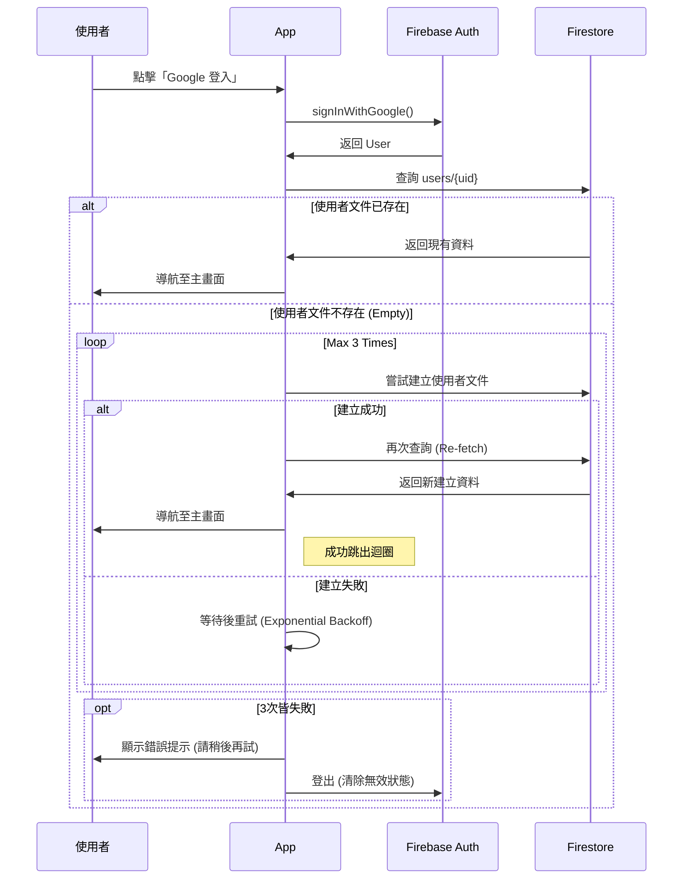
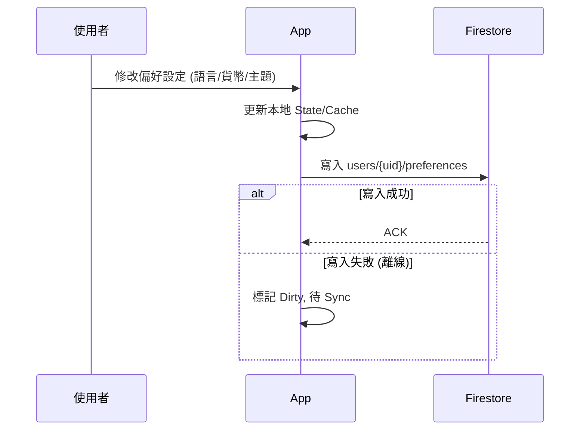
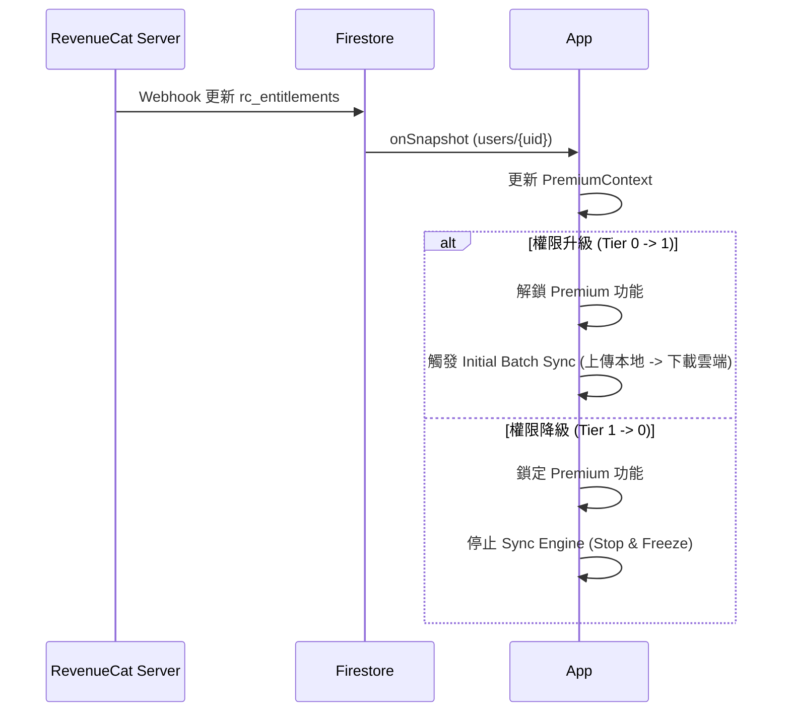
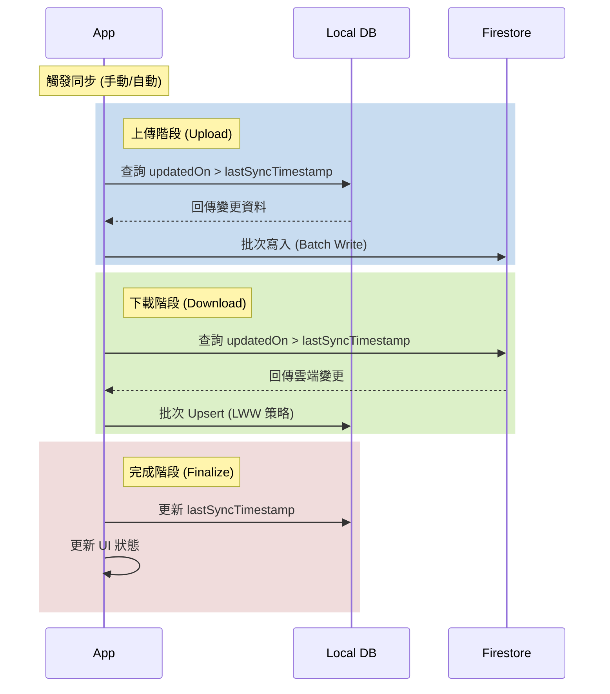
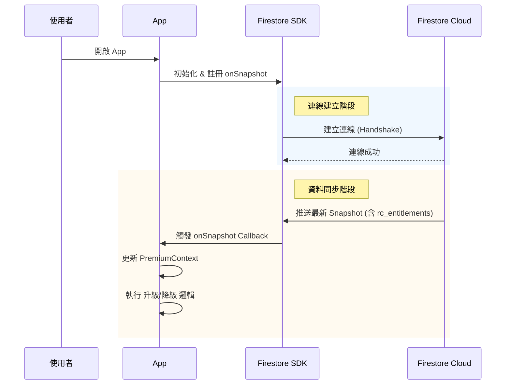
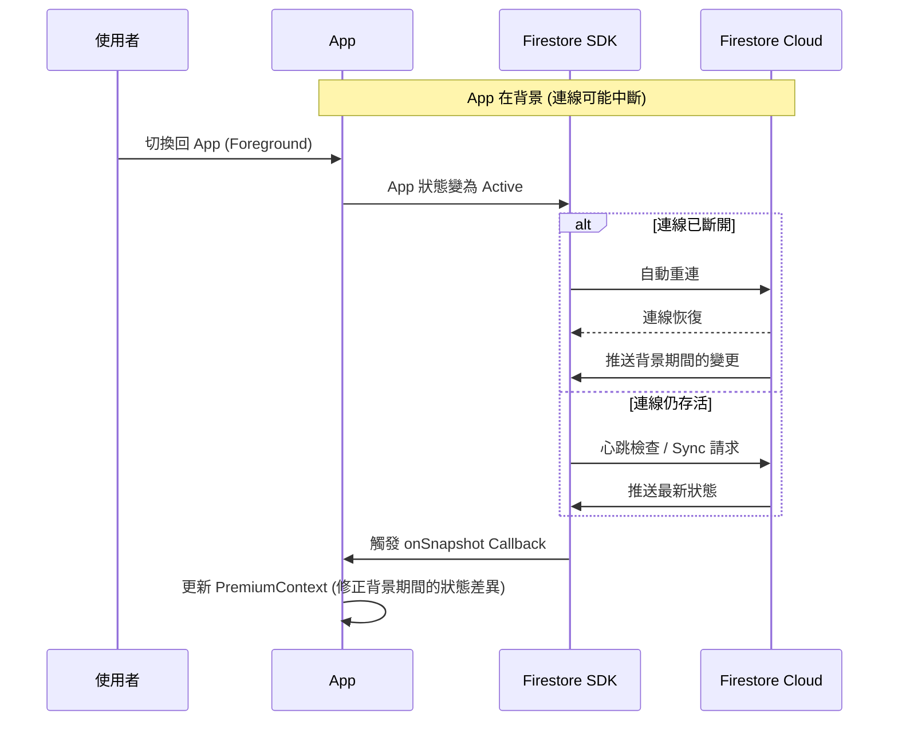
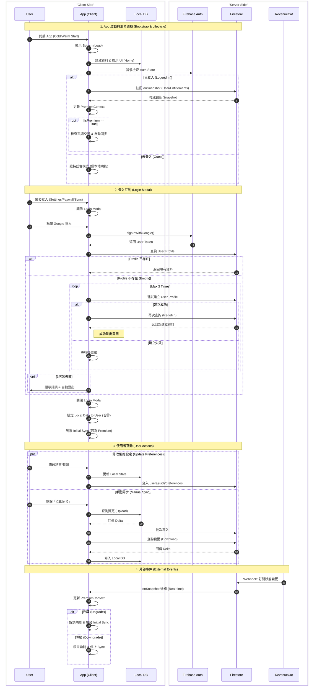

# App Interaction Flows

## 1. 使用者管理流程, User Management Flows

### 首次登入流程, First Login Flow

> **來源**: 移自 `no2_user_management/no2_first_login_flow.md`



### 偏好設定更新流程, Update Preferences Flow

> **情境**: 使用者修改語言、貨幣、主題時。



### 訂閱狀態監聽流程, Subscription Listener Flow

> **情境**: App 運作期間持續監聽權限變更。



---

## 2. 記帳與同步流程, Accounting & Sync Flows
    GenRecurring --> AutoSync{檢查自動同步}
    Recurring -- 無需 --> AutoSync
    
    AutoSync -- > 24hr --> TriggerSync[觸發批次同步]
    AutoSync -- < 24hr --> End
```

### 批次同步流程, Batch Sync Flow

> **來源**: 參考 `no3_accounting_app/no3_background_logics/no3_batch_sync_spec.md`



---

## 3. 系統行為, System Behaviors

### App 生命週期與資料同步行為, App Lifecycle & Sync Behavior

> **目的**: 確保在 App 各種啟動狀態下，使用者權限與資料狀態能維持最終一致性。

#### 冷啟動, Cold Start

> **情境**: App 被完全關閉後重新開啟。



#### 熱啟動, Warm Start (Background to Foreground)

> **情境**: App 在背景執行 (Suspended) 後回到前景。



#### 離線啟動, Offline Launch

> **情境**: 無網路環境下開啟 App。

- **行為**:
    1.  **讀取快照**: SDK 無法連線，直接回傳 **本地快照 (Local Cache)** 給 App。
    2.  **暫時狀態**: App 使用舊的權限狀態運作 (若上次是 Premium，則暫時維持 Premium)。
    3.  **恢復連線**: 當網路恢復時，SDK 自動背景連線並同步。
    4.  **最終一致**: 收到最新 Snapshot 後，App 立即更新 Context 並執行對應的鎖定或解鎖邏輯。

---

## 4. 全域互動總覽, Unified Interaction Overview

> **說明**: 將上述所有流程整合為單一視圖，展示各角色在不同情境下的互動關係。



