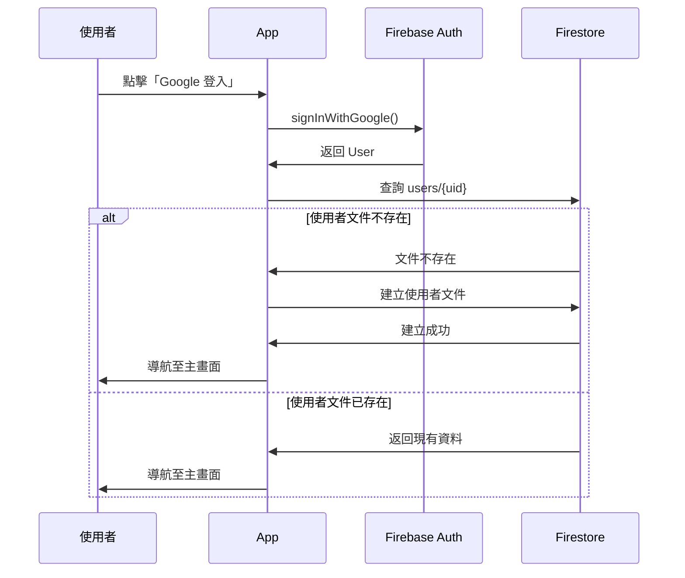
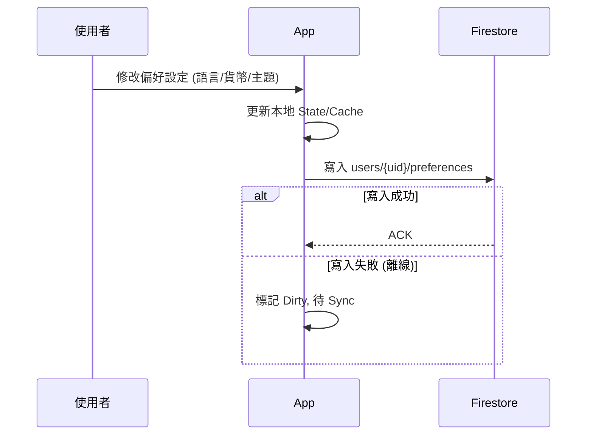
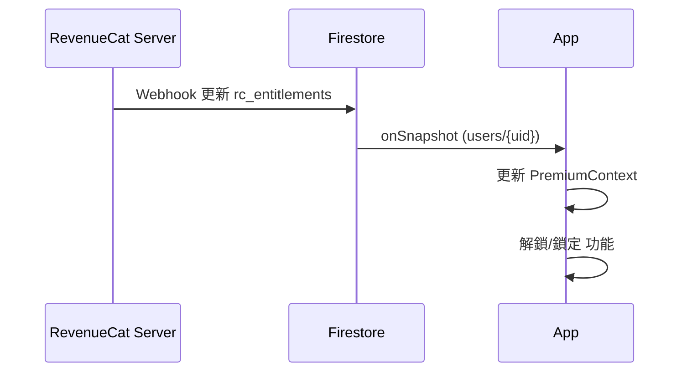

# User Management Interaction Flows

## 首次登入流程, First Login Flow

> **來源**: 移自 `no2_user_management/no2_first_login_flow.md`

---

## 偏好設定更新流程, Update Preferences Flow

> **情境**: 使用者修改語言、貨幣、主題時。

---

## 訂閱狀態監聽流程, Subscription Listener Flow

> **情境**: App 運作期間持續監聽權限變更。

