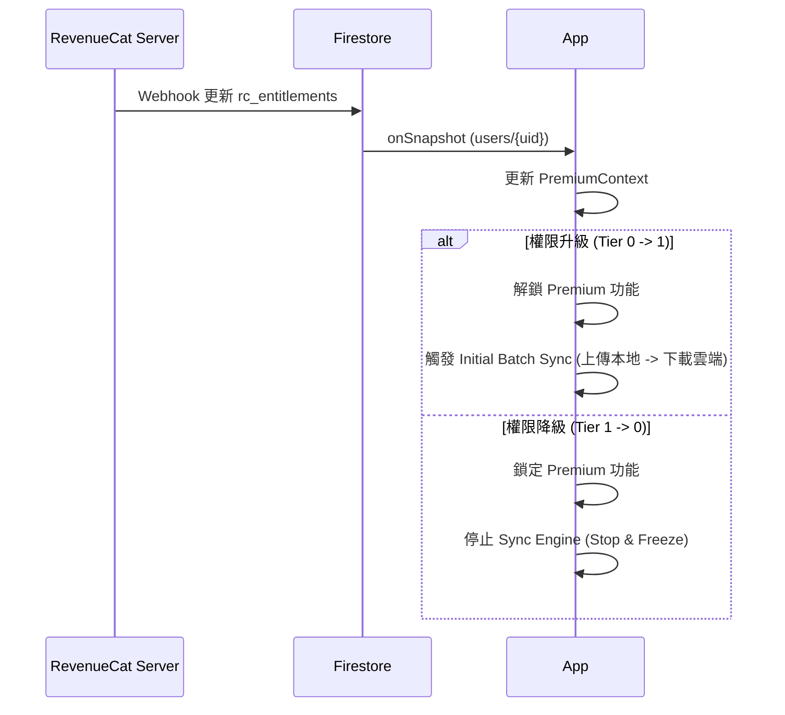
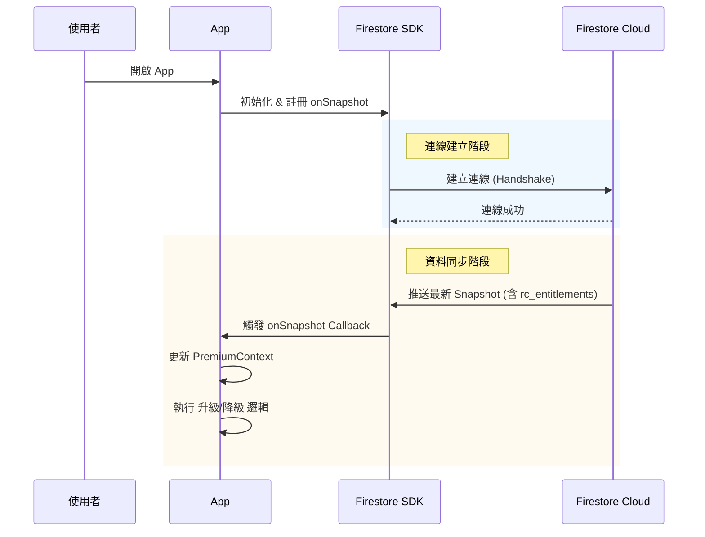
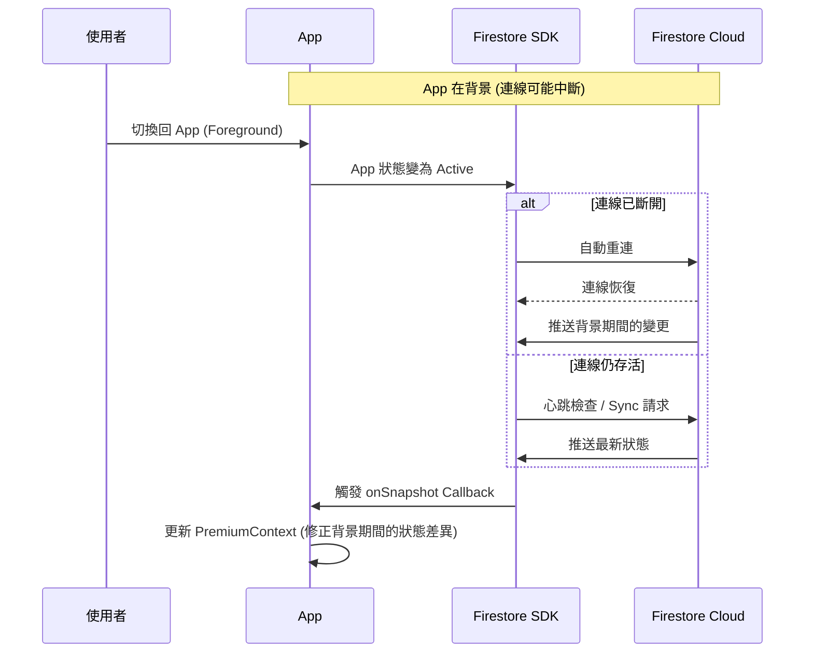

# User Management Interaction Flows

## 首次登入流程, First Login Flow

> **來源**: 移自 `no2_user_management/no2_first_login_flow.md`

---

## 偏好設定更新流程, Update Preferences Flow

> **情境**: 使用者修改語言、貨幣、主題時。

---

## 訂閱狀態監聽流程, Subscription Listener Flow

> **情境**: App 運作期間持續監聽權限變更。

---

## App 生命週期與資料同步行為, App Lifecycle & Sync Behavior

> **目的**: 確保在 App 各種啟動狀態下，使用者權限與資料狀態能維持最終一致性。

### 1. 冷啟動, Cold Start

> **情境**: App 被完全關閉後重新開啟。

### 2. 熱啟動, Warm Start (Background to Foreground)

> **情境**: App 在背景執行 (Suspended) 後回到前景。

### 3. 離線啟動, Offline Launch

> **情境**: 無網路環境下開啟 App。

- **行為**:
    1.  **讀取快照**: SDK 無法連線，直接回傳 **本地快照 (Local Cache)** 給 App。
    2.  **暫時狀態**: App 使用舊的權限狀態運作 (若上次是 Premium，則暫時維持 Premium)。
    3.  **恢復連線**: 當網路恢復時，SDK 自動背景連線並同步。
    4.  **最終一致**: 收到最新 Snapshot 後，App 立即更新 Context 並執行對應的鎖定或解鎖邏輯。
