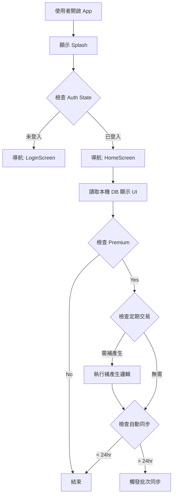
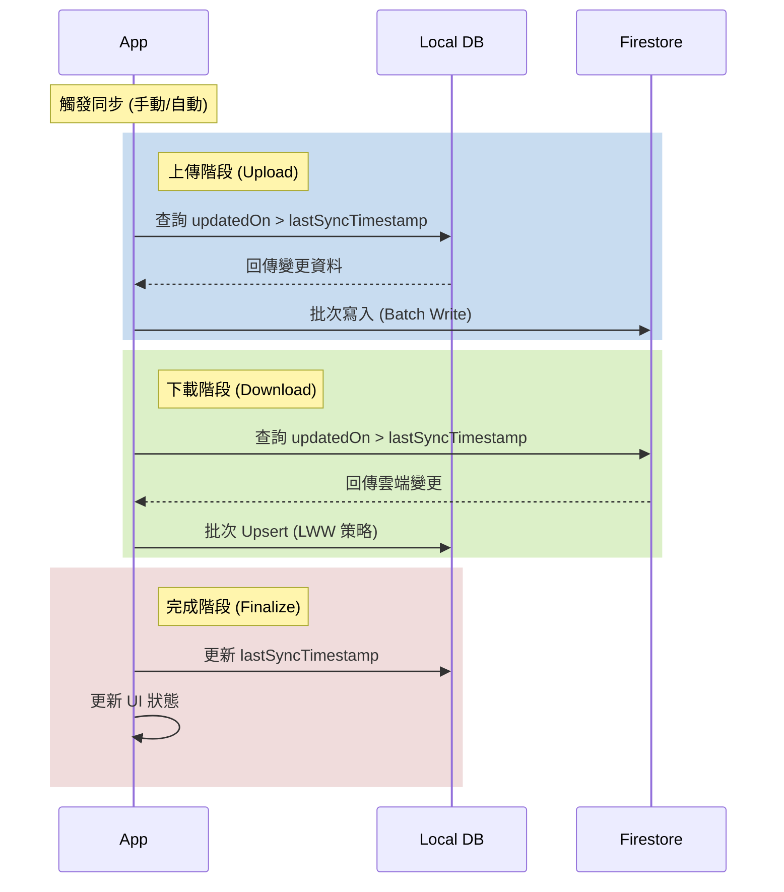

# Accounting App Interaction Flows

## App 啟動流程, App Bootstrap Flow

> **來源**: 參考 `no3_accounting_app/no3_background_logics/no1_app_bootstrap_flow.md`

---

## 批次同步流程, Batch Sync Flow

> **來源**: 參考 `no3_accounting_app/no3_background_logics/no3_batch_sync_spec.md`

