# 全域互動總覽, Unified Interaction Overview

> **核心設計哲學**: **Local-First & Unobtrusive**
> 1.  **不阻擋 (Non-blocking)**: App 啟動後立即進入首頁，不強制登入。
> 2.  **情境感知 (Context-Aware)**: 僅在「冷啟動」且「未登入」時主動提示登入；「熱啟動」則不打擾。
> 3.  **強健性 (Robustness)**: 登入時確保使用者資料完整建立 (Retry & Re-fetch)。
> 4.  **最終一致 (Eventual Consistency)**: 權限與資料狀態透過背景同步達成一致，UI 始終依賴本地狀態 (`PremiumContext`)。

## 圖表語法說明 (Diagram Legend)

| 關鍵字 | 意義 | 程式邏輯類比 | 說明 |
| :--- | :--- | :--- | :--- |
| **opt** | **Optional (可選)** | `if (condition) { ... }` | 只有當條件成立時，才會執行此區塊內的動作。 |
| **par** | **Parallel (平行)** | `Thread 1: ...`   `Thread 2: ...` | 區塊內的動作是 **同時發生** 的，不分先後順序。 |
| **alt** | **Alternative (分支)** | `if (...) { ... } else { ... }` | 條件分支，只會執行其中一條路徑。 |

## 互動時序圖, Interaction Sequence Diagram

```mermaid
sequenceDiagram
    autonumber
    participant U as User
    participant App as App (Client)
    participant Local as Local DB
    participant Auth as Firebase Auth
    participant Cloud as Firestore
    participant RC as RevenueCat

    box "Client Side" #f9f9f9
        participant U
        participant App
        participant Local
    end
    
    box "Server Side" #ececec
        participant Auth
        participant Cloud
        participant RC
    end

    %% ==========================================
    %% 1. App 啟動與生命週期 (Bootstrap & Lifecycle)
    %% ==========================================
    note over U, Cloud: 1. App 啟動 (Bootstrap)
    
    U->>App: 開啟 App
    
    par 前景 UI 渲染 (Main Thread)
        alt 冷啟動 (Cold Start)
            App->>App: 顯示 Splash Screen
            
            opt 首次啟動 (First Launch)
                App->>Local: 檢查 Flag (isInitialized)
                Local-->>App: False
                App->>Local: 執行資料 Seeding (預設分類/帳戶)
                App->>Local: 設定 isInitialized = True
            end
            
            App->>Local: 讀取本地資料 (Load Data)
            App->>App: 渲染 Home UI (Render)
            
        else 熱啟動 (Warm Start)
            App->>App: 恢復前景 (Resume)
            Note right of App: UI 與資料已存在記憶體中，直接顯示
        end
    and 背景邏輯處理 (Background Thread)
        %% 1. 本地快速檢查 (Local Check)
        App->>Auth: 檢查 Auth State (Local Cache)
        App->>App: 讀取 Local PremiumContext
        App->>App: 更新 UI 功能鎖定狀態 (Immediate)
        
        %% 2. 雲端同步與調和 (Remote Sync)
        alt 已登入 (Logged In)
            App->>Cloud: 建立連線 (Handshake)
            App->>Cloud: 註冊 onSnapshot (User/Entitlements)
            Cloud-->>App: 推送最新 Snapshot
            
            App->>App: 比較新舊 PremiumContext
            alt 狀態改變 (State Changed)
                App->>App: 更新 PremiumContext
                App->>App: 觸發 UI 重繪 (Re-render)
                App->>App: 執行 升級/降級 邏輯 (如觸發 Sync)
            else 狀態未變 (No Change)
                App->>App: 維持現有狀態
                Note right of App: 無需重繪，節省資源
            end
            
            opt isPremium == True (Routine Checks)
                Note right of App: 確保使用最新權限狀態執行
                App->>App: 檢查定期交易 (Recurring)
                App->>App: 檢查自動同步 (AutoSync)
            end
            
        else 未登入 (Guest)
            opt 是冷啟動 (Cold Start)
                App->>App: 自動彈出 Login Modal (引導登入)
            end
            Note right of App: 熱啟動則維持訪客模式，不打擾使用者
        end
    end

    %% ==========================================
    %% 2. 登入互動 (Login Interaction)
    %% ==========================================
    note over U, Cloud: 2. 登入流程 (Login Modal)
    
    Note right of U: 觸發點: 冷啟動自動彈出 或 使用者點擊 (設定/付費/同步)
    
    U->>App: 進行 Google 登入
    App->>Auth: signInWithGoogle()
    Auth-->>App: 返回 User Token
    
    rect rgb(240, 248, 255)
        note right of App: 強健資料建立流程 (Robust Creation)
        App->>Cloud: 查詢 User Profile
        
        alt Profile 已存在
            Cloud-->>App: 返回現有資料
        else Profile 不存在 (Empty)
            loop Max 3 Times (Retry Loop)
                App->>Cloud: 嘗試建立 User Profile
                alt 建立成功
                    App->>Cloud: 再次查詢 (Re-fetch Check)
                    Cloud-->>App: 返回新建立資料
                    Note right of App: 成功跳出迴圈
                else 建立失敗
                    App->>App: 等待後重試 (Backoff)
                end
            end
            
            opt 3次皆失敗
                App->>U: 顯示錯誤 & 自動登出 (避免異常狀態)
            end
        end
    end
    
    App->>App: 關閉 Login Modal
    App->>App: 綁定 Local Data to User
    App->>Cloud: 註冊 onSnapshot (啟動同步監聽)

    %% ==========================================
    %% 3. 日常操作與同步 (Operations & Sync)
    %% ==========================================
    note over U, Cloud: 3. 日常操作 (Operations)
    
    par 修改偏好設定
        U->>App: 修改語言/貨幣
        App->>Local: 更新 Local State
        App->>Cloud: 寫入 users/{uid}/preferences
    and 手動同步 (需 Premium)
        U->>App: 點擊「立即同步」
        App->>Local: 查詢變更 (Upload)
        App->>Cloud: 批次寫入
        App->>Cloud: 查詢變更 (Download)
        App->>Local: 批次更新 (LWW)
    end

    %% ==========================================
    %% 4. 外部事件 (External Events)
    %% ==========================================
    note over U, RC: 4. 權限變更 (Entitlement Updates)
    
    RC->>Cloud: Webhook: 訂閱狀態改變
    Cloud->>App: onSnapshot 通知 (Real-time)
    App->>App: 更新 PremiumContext
    
    alt 升級 (Upgrade)
        App->>App: 解鎖功能 & 觸發 Initial Sync
    else 降級 (Downgrade)
        App->>App: 鎖定功能 & 停止 Sync
    end
```

