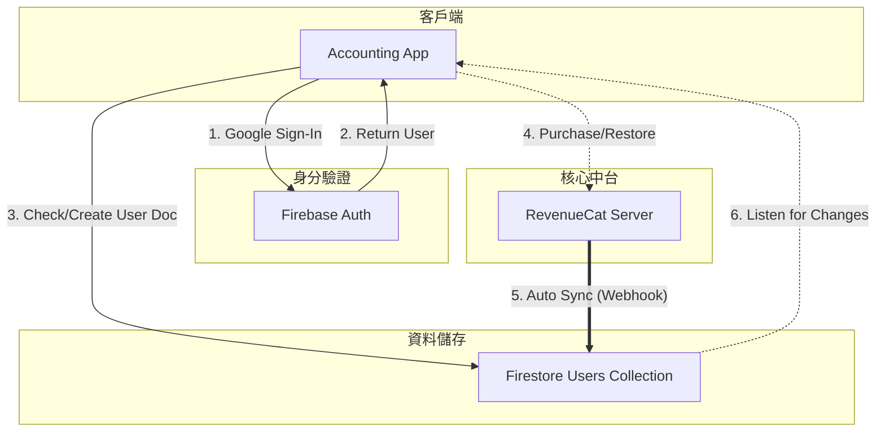

# User Management Module

> **模組版本**: V1
> **最後更新**: 2025-11-25
> **範圍**: 包含使用者身分驗證、個人資料與偏好設定的後端邏輯與資料結構。

---

## 模組目的

- **User Management 模組負責:**
  - **使用者資料儲存:** 在 Firestore 中維護使用者個人資料 (Users Collection)。
  - **身分驗證邏輯:** 定義首次登入與帳號建立流程。
  - **偏好設定管理:** 定義語言、貨幣、時區等偏好設定的資料結構與更新 API。
  - **RevenueCat 整合:** 為訂閱權限資料預留欄位結構。

> [!NOTE]
> 本模組專注於 **後端規格 (Backend Specs)**，包含 Schema、邏輯流程與 API 定義。
> 前端 UI 實作 (如登入畫面、設定畫面) 的規格文件保留於 **Accounting App** 模組中。

---

## 模組結構

本模組採用扁平結構，不另設子資料夾：

```
no1_user_management/
├── no0_overview.md                    # 本文件
├── no1_users_schema.md                # Firestore Users collection 定義 (含偏好設定)
├── no2_first_login_flow.md            # 首次登入建立使用者邏輯
└── no3_update_preferences_api.md      # 更新使用者偏好設定 API
```

---

## 相關文件
# User Management Module

> **模組版本**: V1
> **最後更新**: 2025-11-25
> **範圍**: 包含使用者身分驗證、個人資料與偏好設定的後端邏輯與資料結構。

---

## 模組目的

- **User Management 模組負責:**
  - **使用者資料儲存:** 在 Firestore 中維護使用者個人資料 (Users Collection)。
  - **身分驗證邏輯:** 定義首次登入與帳號建立流程。
  - **偏好設定管理:** 定義語言、貨幣、時區等偏好設定的資料結構與更新 API。
  - **RevenueCat 整合:** 為訂閱權限資料預留欄位結構。

> [!NOTE]
> 本模組專注於 **後端規格 (Backend Specs)**，包含 Schema、邏輯流程與 API 定義。
> 前端 UI 實作 (如登入畫面、設定畫面) 的規格文件保留於 **Accounting App** 模組中。

---

## 模組結構

本模組採用扁平結構，不另設子資料夾：

```
no1_user_management/
├── no0_overview.md                    # 本文件
├── no1_users_schema.md                # Firestore Users collection 定義 (含偏好設定)
├── no2_first_login_flow.md            # 首次登入建立使用者邏輯
└── no3_update_preferences_api.md      # 更新使用者偏好設定 API
```

---

## 相關文件

- **Accounting App Module**: 包含 LoginScreen 與 PreferenceScreen 的 UI 規格。
- **RevenueCat 整合**: 參見 IAP 訂閱系統完整流程。

---

## 實作重點

- **Firestore Users Collection:**
  - **單一真理來源:** 所有使用者偏好如 Language, Currency, TimeZone 皆以此 Collection 為準。
  - **RevenueCat 同步:** 自動寫入訂閱狀態，不需手動維護。

- **首次登入邏輯:**
  - **冪等性:** 確保重複觸發也不會破壞現有資料。
  - **預設值:** 新用戶自動帶入預設偏好如 zh-TW, TWD, Asia/Taipei。

- **偏好設定更新:**
  - **API:** 提供簡單的介面供前端更新偏好。

---

## 系統互動流程

Accounting App 在以下情境需要與 Firestore 互動：

1.  **首次開啟 App (Onboarding)**: 檢查並建立使用者文件。
2.  **訂閱狀態變更**: 監聽 RevenueCat 同步至 Firestore 的權限欄位。
3.  **偏好設定變更**: 使用者在 App 修改設定時，即時更新 Firestore。

