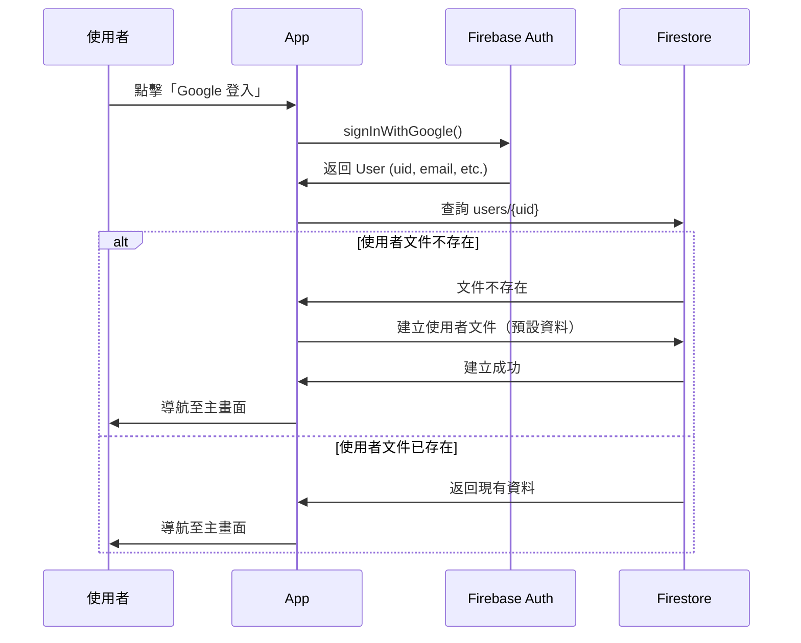

# 首次登入流程 (First Login Flow)

> **目的**: 新使用者首次登入時，在 Firestore 建立使用者文件  
> **執行時機**: 使用者透過 Google 登入後  
> **執行位置**: App 端（React Native）

---

## 流程圖



---

## 實作邏輯

### Step 1: 使用者登入

```typescript
// App 端 (React Native)
import auth from '@react-native-firebase/auth';

async function handleGoogleLogin() {
  try {
    // Google 登入
    const googleUser = await GoogleSignin.signIn();
    const googleCredential = auth.GoogleAuthProvider.credential(
      googleUser.idToken
    );
    
    // Firebase Auth 登入
    const userCredential = await auth().signInWithCredential(googleCredential);
    const user = userCredential.user;
    
    // 檢查並建立使用者文件
    await ensureUserDocument(user);
    
    // 導航至主畫面
    navigation.navigate('Home');
  } catch (error) {
    console.error('Login failed', error);
    showErrorDialog('登入失敗，請稍後再試');
  }
}
```

---

### Step 2: 檢查並建立使用者文件

```typescript
import firestore from '@react-native-firebase/firestore';
import { FirebaseAuthTypes } from '@react-native-firebase/auth';

async function ensureUserDocument(user: FirebaseAuthTypes.User) {
  const userRef = firestore().collection('users').doc(user.uid);
  
  // 使用 get() 檢查文件是否存在
  const userDoc = await userRef.get();
  
  if (!userDoc.exists) {
    // 文件不存在，建立新使用者
    console.log('New user detected, creating user document...');
    
    await userRef.set({
      uid: user.uid,
      email: user.email,
      displayName: user.displayName || '',
      photoURL: user.photoURL || '',
      provider: 'google.com',
      
      preferences: {
        language: getDeviceLanguage(), // 'zh-TW' or 'en'
        currency: 'TWD',
        timezone: getDeviceTimezone(), // 'Asia/Taipei'
        theme: 'system'
      },
      
      // RevenueCat 欄位初始為空
      rc_entitlements: {},
      rc_active_subscriptions: [],
      
      createdAt: firestore.FieldValue.serverTimestamp(),
      updatedAt: firestore.FieldValue.serverTimestamp()
    });
    
    console.log('User document created successfully');
  } else {
    // 文件已存在，更新登入時間（可選）
    await userRef.update({
      updatedAt: firestore.FieldValue.serverTimestamp()
    });
    
    console.log('Existing user logged in');
  }
}
```

---

### Step 3: 輔助函式

```typescript
/**
 * 取得裝置語言設定
 */
function getDeviceLanguage(): string {
  const deviceLang = NativeModules.I18nManager.localeIdentifier || 'zh-TW';
  
  // 支援的語言列表
  const supportedLanguages = ['zh-TW', 'en'];
  
  // 檢查裝置語言是否支援
  if (supportedLanguages.includes(deviceLang)) {
    return deviceLang;
  }
  
  // 預設值
  return 'zh-TW';
}

/**
 * 取得裝置時區
 */
function getDeviceTimezone(): string {
  return RNLocalize.getTimeZone() || 'Asia/Taipei';
}
```

---

## 錯誤處理

### 網路錯誤

```typescript
try {
  await ensureUserDocument(user);
} catch (error) {
  if (error.code === 'firestore/unavailable') {
    // 網路問題，使用本地快取繼續
    console.warn('Firestore unavailable, using cache');
    // App 可正常運行（Local-First 架構）
  } else {
    // 其他錯誤
    console.error('Failed to create user document', error);
    throw error;
  }
}
```

### 並發問題

如果多個裝置同時首次登入（極少見），Firestore 的 `set()` 會確保冪等性：
- 第一個 `set()` 建立文件
- 後續 `set()` 覆寫（但資料相同，無影響）

---

## RevenueCat 初始化

在建立使用者文件後，初始化 RevenueCat SDK：

```typescript
import Purchases from 'react-native-purchases';

async function initializeRevenueCat(user: FirebaseAuthTypes.User) {
  // 配置 RevenueCat
  await Purchases.configure({
    apiKey: Platform.OS === 'ios' ? IOS_API_KEY : ANDROID_API_KEY,
    appUserID: user.uid // 關鍵：使用 Firebase UID
  });
  
  console.log('RevenueCat initialized with user:', user.uid);
  
  // 獲取最新訂閱狀態（會觸發 Firebase Integration 同步）
  const customerInfo = await Purchases.getCustomerInfo();
  console.log('Customer info:', customerInfo);
}
```

---

## 測試場景

### 場景 1: 全新使用者
1. 使用者首次使用 Google 登入
2. Firestore 建立新文件
3. RevenueCat 建立新 subscriber
4. 文件包含預設偏好設定

### 場景 2: 既有使用者（換裝置）
1. 使用者在新裝置登入
2. Firestore 返回既有文件
3. RevenueCat 恢復訂閱狀態（使用相同 appUserID）
4. App 顯示既有偏好設定

### 場景 3: 離線首次登入
1. 使用者在無網路環境登入（不太可能，因登入需網路）
2. 若發生，延後建立文件至恢復網路時
3. App 使用本地預設值運行

---

## 注意事項

### ✅ 最佳實踐
- 使用 `serverTimestamp()` 而非客戶端時間
- 確保冪等性（重複執行不會出錯）
- 優雅處理網路錯誤

### ⚠️ 避免
- 不要在建立文件時執行複雜邏輯
- 不要阻塞 UI（使用 async/await）
- 不要假設 Firestore 操作一定成功

---

**文件結束**
