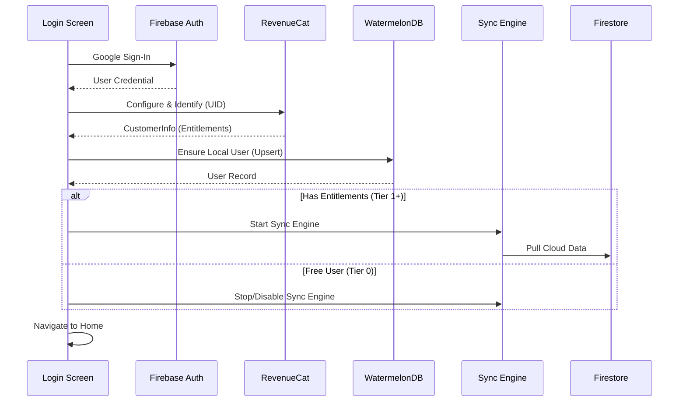

# 首次登入流程

> [!NOTE]
> 完整互動流程圖請參閱: `no1_interaction_flows/no1_interaction_flow.md`

## 實作邏輯 Local-First

### 核心原則

- **本地優先:** 登入後立即寫入/讀取本地資料庫 WatermelonDB。
- **雲端為輔:** 僅在使用者擁有付費權限 Tier 1+ 時，才啟動 Sync Engine 連線 Firestore。
- **無縫體驗:** Tier 0 使用者完全無感於雲端存在，確保離線可用。

### 使用者登入流程



### 程式碼範例

```typescript
// React Native App 端
import auth from '@react-native-firebase/auth';
import Purchases from 'react-native-purchases';
import { database } from '../database'; // WatermelonDB instance

async function handleGoogleLogin() {
  try {
    // 1. Google & Firebase 登入
    const googleUser = await GoogleSignin.signIn();
    const googleCredential = auth.GoogleAuthProvider.credential(googleUser.idToken);
    const userCredential = await auth().signInWithCredential(googleCredential);
    const user = userCredential.user;
    
    // 2. RevenueCat 初始化與識別
    await Purchases.configure({ apiKey: API_KEY, appUserID: user.uid });
    const customerInfo = await Purchases.getCustomerInfo();
    const isPremium = typeof customerInfo.entitlements.active['premium'] !== 'undefined';
    
    // 3. 確保本地使用者存在 (WatermelonDB)
    await database.write(async () => {
      const usersCollection = database.get('users');
      try {
        const localUser = await usersCollection.find(user.uid);
        // 更新登入時間
        await localUser.update(u => {
            u.lastLoginAt = Date.now();
        });
      } catch (e) {
        // 建立新使用者
        await usersCollection.create(u => {
          u._id = user.uid;
          u.email = user.email;
          u.displayName = user.displayName;
          u.photoURL = user.photoURL;
          u.preferences = {
             language: getDeviceLanguage(),
             currency: 'TWD',
             theme: 'system'
          };
          u.createdAt = Date.now();
        });
      }
    });
    
    // 4. 根據權限決定是否啟動同步
    if (isPremium) {
        console.log('Premium user detected, starting Sync Engine...');
        SyncEngine.start(); // 觸發與 Firestore 同步
    } else {
        console.log('Free user, staying offline.');
        SyncEngine.stop();
    }
    
    // 5. 導航
    navigation.navigate('Home');
    
  } catch (error) {
    console.error('Login failed', error);
    showErrorDialog('登入失敗，請稍後再試');
  }
}
```

---

## 同步與衝突處理


### RevenueCat 驅動同步

同步功能的開關完全由 RevenueCat 的 `entitlements` 決定。
- **Tier 0:** `SyncEngine` 保持關閉。App 行為如同純單機 App。
- **Tier 1:** `SyncEngine` 啟動，負責將本地資料備份至雲端，或從雲端拉取舊資料。

### 資料衝突處理 首次登入

若使用者是 Tier 1 且在全新裝置登入：
- `ensureUserDocument` 會先建立一個「本地空使用者」。
- `SyncEngine` 啟動後，從 Firestore 拉取「雲端使用者資料」。
- `SyncEngine` 執行 LWW Last Write Wins 合併，雲端資料 通常較舊或較新 會覆蓋或合併本地初始資料。
- **備註:** 由於是全新裝置，本地初始資料僅包含預設值，被雲端覆蓋是預期行為。

---

## 錯誤處理

### 網路錯誤

- **Auth 階段:** 必須有網路才能進行 Google/Firebase 登入。若無網路，應提示使用者檢查連線。
- **RevenueCat:** 若無法連線，預設視為無權限 Tier 0，確保使用者能進入 App 使用基本功能。
- **Sync:** 若 Sync Engine 無法連線，僅影響備份，不影響 App 操作。

### 本地資料庫錯誤

- WatermelonDB 寫入失敗極為罕見 通常是磁碟滿。若發生，應顯示嚴重錯誤並阻擋進入，因為 App 無法在無 DB 狀態下運作。
