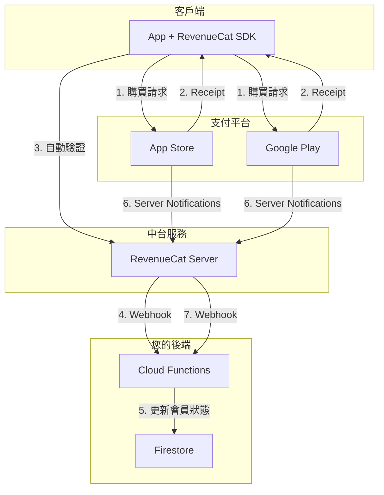
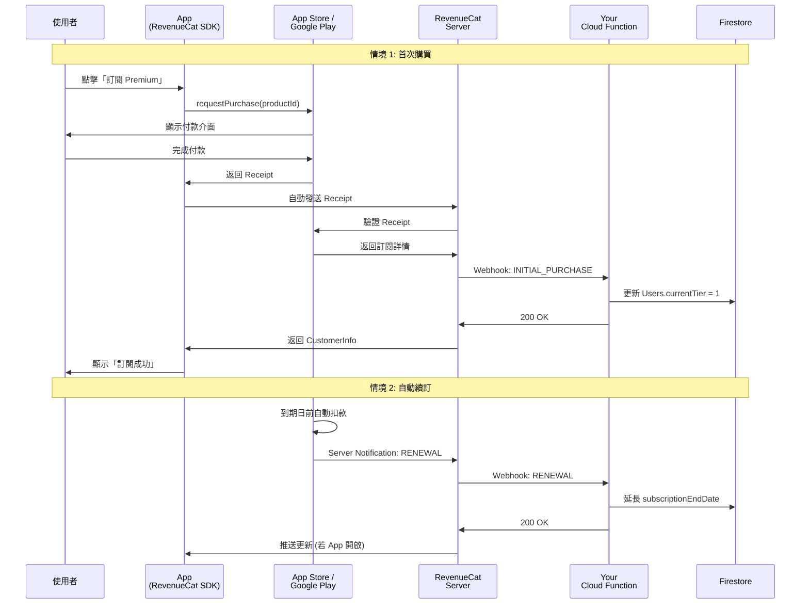
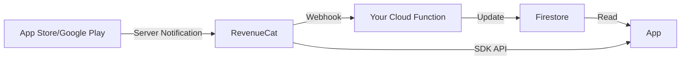
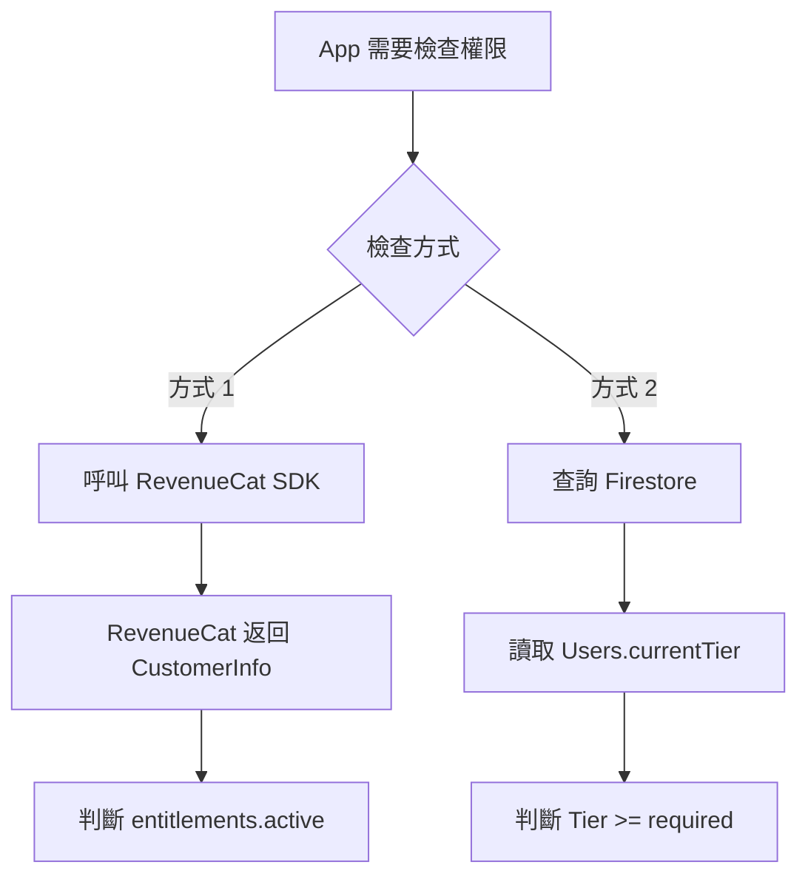

# IAP 訂閱系統完整流程 (Pure IAP Subscription Flow)

> **建立日期**: 2025-11-23  
> **情境**: 純 IAP 訂閱，不包含序號系統  
> **目的**: 釐清 App、Backend、RevenueCat、App Store、Google Play 之間的合作關係

---

## 系統角色定義

### 參與系統

| 系統 | 角色 | 主要職責 |
|------|------|---------|
| **App** | 客戶端 | 顯示 UI、發起購買、本地狀態管理 |
| **RevenueCat** | 訂閱中台 | 統一 IAP SDK、驗證 Receipt、監聽通知、提供跨平台 API |
| **App Store** | 支付平台 (iOS) | 處理付款、管理訂閱、發送通知 |
| **Google Play** | 支付平台 (Android) | 處理付款、管理訂閱、發送通知 |
| **Your Backend** | 業務邏輯 | 會員等級管理、功能權限控制 |
| **Firestore** | 資料庫 | 儲存使用者會員狀態 |

---

### 系統關係圖



---

## 完整流程圖總覽



---

## 情境詳解

### 情境 1: 首次購買 (Initial Purchase)

#### 流程步驟

**Step 1: 使用者觸發購買**
```typescript
// App 端 (使用 RevenueCat SDK)
import Purchases from 'react-native-purchases';

async function handlePurchase() {
  try {
    // 顯示 loading
    setLoading(true);
    
    // 透過 RevenueCat 發起購買
    const purchaseResult = await Purchases.purchasePackage(selectedPackage);
    
    // RevenueCat 會自動:
    // 1. 呼叫 App Store/Google Play 的購買 API
    // 2. 獲取 Receipt
    // 3. 發送到 RevenueCat Server 驗證
    // 4. 返回 CustomerInfo
    
    const customerInfo = purchaseResult.customerInfo;
    
    // 檢查是否有 Premium 權限
    if (customerInfo.entitlements.active['premium']) {
      // 購買成功！
      showSuccessDialog();
      
      // 本地狀態更新（可選）
      updateLocalPremiumStatus(true);
    }
  } catch (error) {
    if (error.userCancelled) {
      // 使用者取消購買
      console.log('User cancelled purchase');
    } else {
      // 其他錯誤
      showErrorDialog('購買失敗，請稍後再試');
    }
  } finally {
    setLoading(false);
  }
}
```

---

**Step 2: App Store/Google Play 處理付款**

```
使用者視角:
1. App 顯示付款介面 (由 OS 原生提供)
2. 使用者確認付款 (Touch ID / Face ID / 密碼)
3. 扣款成功

Apple/Google 做的事:
- 從使用者的付款方式扣款
- 建立交易記錄 (Transaction)
- 生成 Receipt (收據)
- 返回給 App
```

**Transaction 資料範例** (Apple):
```json
{
  "transaction_id": "1000000123456789",
  "original_transaction_id": "1000000123456789",
  "product_id": "com.yourapp.premium.monthly",
  "purchase_date_ms": "1700000000000",
  "expires_date_ms": "1702592000000",
  "is_trial_period": "false",
  "in_intro_offer_period": "false"
}
```

---

**Step 3: RevenueCat 驗證 Receipt**

```
RevenueCat SDK 自動執行:
1. 獲取 Receipt from App Store/Google Play
2. 發送到 RevenueCat Server
3. RevenueCat Server → App Store/Google Play 驗證 API
4. 驗證成功 → 儲存於 RevenueCat 資料庫
5. 返回 CustomerInfo 給 App
```

**RevenueCat Server 呼叫 Apple API**:
```bash
POST https://buy.itunes.apple.com/verifyReceipt
Content-Type: application/json

{
  "receipt-data": "MIITtgYJKoZIhvcNAQcCoIITpzCCE...",
  "password": "your_shared_secret",
  "exclude-old-transactions": true
}
```

---

**Step 4: RevenueCat Webhook 通知您的後端**

RevenueCat 發送 Webhook 到您設定的 URL:

```
POST https://yourapp.com/api/v1/webhooks/revenuecat
Content-Type: application/json
X-RevenueCat-Signature: sha256=...

{
  "event": {
    "type": "INITIAL_PURCHASE",
    "app_user_id": "firebase_uid_abc123",
    "product_id": "com.yourapp.premium.monthly",
    "purchased_at_ms": 1700000000000,
    "expiration_at_ms": 1702592000000,
    "environment": "PRODUCTION",
    "store": "APP_STORE",
    "transaction_id": "1000000123456789",
    "original_transaction_id": "1000000123456789"
  }
}
```

**您的 Cloud Function 處理**:
```typescript
// Cloud Function: /api/v1/webhooks/revenuecat
import * as functions from 'firebase-functions';
import * as admin from 'firebase-admin';

export const revenueCatWebhook = functions.https.onRequest(async (req, res) => {
  // 1. 驗證 Webhook 簽名 (重要！)
  const signature = req.headers['x-revenuecat-signature'];
  if (!verifyRevenueCatSignature(req.body, signature)) {
    return res.status(401).send('Invalid signature');
  }
  
  const event = req.body.event;
  const userId = event.app_user_id;
  const productId = event.product_id;
  const expiresAt = event.expiration_at_ms;
  
  // 2. 根據事件類型處理
  if (event.type === 'INITIAL_PURCHASE' || event.type === 'RENEWAL') {
    // 映射商品到會員等級
    const tier = mapProductToTier(productId);
    // com.yourapp.premium.monthly -> Tier 1
    // com.yourapp.pro.monthly -> Tier 2
    
    // 3. 更新 Firestore
    await admin.firestore().collection('Users').doc(userId).update({
      currentTier: tier,
      subscriptionStatus: 'active',
      subscriptionEndDate: expiresAt,
      subscriptionSource: event.store === 'APP_STORE' ? 'apple_iap' : 'google_iap',
      iapProductId: productId,
      iapTransactionId: event.transaction_id,
      updatedOn: Date.now()
    });
    
    // 4. 記錄交易歷史
    await admin.firestore().collection('IAPTransactions').add({
      userId,
      productId,
      transactionId: event.transaction_id,
      purchasedAt: event.purchased_at_ms,
      expiresAt: expiresAt,
      eventType: event.type,
      store: event.store,
      createdOn: Date.now()
    });
    
    console.log(`User ${userId} upgraded to Tier ${tier}`);
  }
  
  // 5. 回應 RevenueCat (重要！必須回 200)
  res.status(200).send('OK');
});

function mapProductToTier(productId: string): number {
  const mapping = {
    'com.yourapp.premium.monthly': 1,
    'com.yourapp.premium.yearly': 1,
    'com.yourapp.pro.monthly': 2,
    'com.yourapp.pro.yearly': 2,
  };
  return mapping[productId] || 0;
}
```

---

**Step 5: App 獲得更新**

```typescript
// App 端
// RevenueCat SDK 會自動更新本地的 CustomerInfo
Purchases.addCustomerInfoUpdateListener((customerInfo) => {
  // 即時更新 UI
  const isPremium = customerInfo.entitlements.active['premium'] !== undefined;
  updatePremiumStatus(isPremium);
});

// 或主動查詢
const customerInfo = await Purchases.getCustomerInfo();
console.log('Active entitlements:', customerInfo.entitlements.active);
```

---

#### 系統職責分工 (首次購買)

| 步驟 | App | App Store/Google | RevenueCat | Your Backend | Firestore |
|------|-----|------------------|------------|--------------|-----------|
| 1. 發起購買 | ✅ 呼叫 SDK | - | ✅ 轉發請求 | - | - |
| 2. 處理付款 | - | ✅ 扣款 | - | - | - |
| 3. 返回 Receipt | - | ✅ 生成 | ✅ 接收 | - | - |
| 4. 驗證 Receipt | - | ✅ 提供驗證 API | ✅ 呼叫驗證 | - | - |
| 5. 儲存訂閱狀態 | - | ✅ 自己的資料庫 | ✅ 自己的資料庫 | - | - |
| 6. 發送 Webhook | - | - | ✅ 發送 | ✅ 接收 | - |
| 7. 更新會員等級 | - | - | - | ✅ 業務邏輯 | ✅ 儲存 |
| 8. 更新 UI | ✅ 顯示成功 | - | ✅ 推送更新 | - | - |

---

### 情境 2: 自動續訂成功 (Auto-Renewal Success)

#### 流程步驟

**背景**: 使用者在 30 天前購買了 Premium Monthly，現在快到期了。

**Step 1: App Store/Google Play 自動扣款**

```
時間線:
Day 0:  使用者購買 Premium (到期日 = Day 30)
Day 29: App Store/Google 嘗試自動扣款
        ↓
        扣款成功
        ↓
        生成新的 Transaction
        新到期日 = Day 60
```

**重要**: 這個過程**完全自動**，不需要 App 開啟，甚至使用者可能完全無感。

---

**Step 2: App Store/Google 發送 Server Notification**

Apple 發送通知到 RevenueCat:
```json
{
  "notification_type": "DID_RENEW",
  "latest_receipt_info": {
    "transaction_id": "1000000234567890",
    "original_transaction_id": "1000000123456789",
    "product_id": "com.yourapp.premium.monthly",
    "purchase_date_ms": "1702592000000",
    "expires_date_ms": "1705270400000"
  }
}
```

---

**Step 3: RevenueCat 處理並轉發**

```
RevenueCat 收到 Apple/Google 通知:
1. 更新自己資料庫中的訂閱狀態
2. 生成統一格式的 Webhook 事件
3. 發送到您的後端
```

RevenueCat Webhook:
```json
{
  "event": {
    "type": "RENEWAL",
    "app_user_id": "firebase_uid_abc123",
    "product_id": "com.yourapp.premium.monthly",
    "purchased_at_ms": 1702592000000,
    "expiration_at_ms": 1705270400000,
    "is_trial_period": false,
    "transaction_id": "1000000234567890",
    "original_transaction_id": "1000000123456789"
  }
}
```

---

**Step 4: Your Cloud Function 更新 Firestore**

```typescript
// Cloud Function 處理 RENEWAL 事件
if (event.type === 'RENEWAL') {
  const userId = event.app_user_id;
  const newExpiresAt = event.expiration_at_ms;
  
  // 延長訂閱到期日
  await admin.firestore().collection('Users').doc(userId).update({
    subscriptionEndDate: newExpiresAt,
    subscriptionStatus: 'active',
    updatedOn: Date.now()
  });
  
  // 記錄續訂事件
  await admin.firestore().collection('SubscriptionEvents').add({
    userId,
    eventType: 'renewal',
    transactionId: event.transaction_id,
    expiresAt: newExpiresAt,
    createdOn: Date.now()
  });
  
  console.log(`User ${userId} subscription renewed until ${new Date(newExpiresAt)}`);
}
```

---

**Step 5: App 獲得更新 (若開啟)**

```typescript
// 當使用者下次開啟 App 時
useEffect(() => {
  // RevenueCat SDK 會自動同步最新狀態
  async function checkSubscriptionStatus() {
    const customerInfo = await Purchases.getCustomerInfo();
    
    if (customerInfo.entitlements.active['premium']) {
      console.log('Premium active until:', 
        customerInfo.entitlements.active['premium'].expirationDate);
    }
  }
  
  checkSubscriptionStatus();
}, []);
```

---

#### 系統職責分工 (自動續訂)

| 步驟 | App | App Store/Google | RevenueCat | Your Backend | Firestore |
|------|-----|------------------|------------|--------------|-----------|
| 1. 判斷續訂時機 | - | ✅ 自動判斷 | - | - | - |
| 2. 扣款 | - | ✅ 執行 | - | - | - |
| 3. 發送通知 | - | ✅ 發送 | ✅ 接收 | - | - |
| 4. 轉發 Webhook | - | - | ✅ 轉發 | ✅ 接收 | - |
| 5. 延長到期日 | - | - | - | ✅ 更新邏輯 | ✅ 儲存 |
| 6. 同步狀態 | ✅ 下次開啟時同步 | - | ✅ 提供 API | - | - |

**關鍵**: App 完全不參與續訂流程，一切由 Apple/Google → RevenueCat → Your Backend 自動完成。

---

### 情境 3: 自動續訂失敗 (Renewal Failed)

#### 可能原因
- 信用卡過期
- 餘額不足
- 銀行拒絕交易
- 使用者更換付款方式但未更新

---

#### 流程步驟

**Step 1: App Store/Google 扣款失敗**

```
Apple/Google 行為:
1. 嘗試扣款 → 失敗
2. 進入「寬限期」(Billing Grace Period)
   - Apple: 16 天
   - Google: 可設定 3/7 天
3. 期間內會重試扣款
4. 若持續失敗 → 訂閱過期
```

---

**Step 2: 發送失敗通知**

Apple Notification:
```json
{
  "notification_type": "DID_FAIL_TO_RENEW",
  "latest_receipt_info": {
    "transaction_id": "1000000234567890",
    "expires_date_ms": "1705270400000",
    "is_in_billing_retry_period": "true"
  }
}
```

---

**Step 3: RevenueCat 轉發**

```json
{
  "event": {
    "type": "BILLING_ISSUE",
    "app_user_id": "firebase_uid_abc123",
    "expiration_at_ms": 1705270400000,
    "grace_period_expires_at_ms": 1706652000000
  }
}
```

---

**Step 4: Your Backend 處理**

```typescript
if (event.type === 'BILLING_ISSUE') {
  const userId = event.app_user_id;
  
  // 標記為「計費問題」狀態
  await admin.firestore().collection('Users').doc(userId).update({
    subscriptionStatus: 'billing_issue',
    gracePeriodEndsAt: event.grace_period_expires_at_ms,
    updatedOn: Date.now()
  });
  
  // 發送推送通知給使用者
  await sendPushNotification(userId, {
    title: '訂閱更新失敗',
    body: '您的付款方式無法完成扣款，請更新付款資訊以繼續使用 Premium 功能',
    action: 'UPDATE_PAYMENT'
  });
}
```

---

**Step 5: 使用者修正付款方式**

```
兩種可能結果:

✅ 情況 A: 使用者更新付款方式 → 扣款成功
   → Apple/Google 發送 DID_RECOVER 通知
   → RevenueCat → Your Backend 更新狀態為 'active'

❌ 情況 B: 寬限期結束仍未修正
   → Apple/Google 發送 EXPIRED 通知
   → RevenueCat → Your Backend 降級用戶
```

---

#### 您的處理策略

**寬限期內**:
```typescript
// 檢查使用者權限
function checkPremiumAccess(user: User): boolean {
  const now = Date.now();
  
  // 在寬限期內仍給予權限
  if (user.subscriptionStatus === 'billing_issue') {
    if (user.gracePeriodEndsAt && now < user.gracePeriodEndsAt) {
      return true; // 仍可使用
    }
  }
  
  // 其他正常判斷
  return user.subscriptionStatus === 'active' 
    && user.subscriptionEndDate > now;
}
```

---

### 情境 4: 使用者主動取消訂閱 (User Cancellation)

#### 取消方式

**iOS**:
```
設定 → [使用者名稱] → 訂閱項目 → [您的 App] → 取消訂閱
```

**Android**:
```
Google Play Store → 選單 → 訂閱項目 → [您的 App] → 取消訂閱
```

**重要**: 使用者**不是**在您的 App 內取消，而是在系統設定中取消。

---

#### 流程步驟

**Step 1: 使用者在 Apple/Google 取消**

```
Apple/Google 行為:
1. 使用者點擊「取消訂閱」
2. 確認取消
3. autoRenew 設為 false
4. 當前訂閱期仍有效（已付費）
5. 到期後不再續訂
```

**範例**:
- 購買日期: 2025-01-01
- 到期日期: 2025-01-31
- 取消日期: 2025-01-15
- **實際過期**: 2025-01-31 (仍可用到月底)

---

**Step 2: Apple/Google 發送通知**

```json
{
  "notification_type": "CANCEL",
  "auto_renew_status": "false",
  "latest_receipt_info": {
    "expires_date_ms": "1706652000000",
    "cancellation_date_ms": "1705788000000"
  }
}
```

---

**Step 3: RevenueCat 轉發**

```json
{
  "event": {
    "type": "CANCELLATION",
    "app_user_id": "firebase_uid_abc123",
    "expiration_at_ms": 1706652000000,
    "cancellation_at_ms": 1705788000000
  }
}
```

---

**Step 4: Your Backend 更新狀態**

```typescript
if (event.type === 'CANCELLATION') {
  const userId = event.app_user_id;
  
  // 更新狀態為「已取消」但仍在有效期內
  await admin.firestore().collection('Users').doc(userId).update({
    subscriptionStatus: 'canceled', // 已取消但尚未過期
    autoRenew: false,
    canceledAt: event.cancellation_at_ms,
    subscriptionEndDate: event.expiration_at_ms, // 仍保留到期日
    updatedOn: Date.now()
  });
  
  console.log(`User ${userId} canceled, will expire at ${new Date(event.expiration_at_ms)}`);
}
```

---

**Step 5: App 顯示狀態**

```typescript
// App 端 UI
function SubscriptionStatus() {
  const [status, setStatus] = useState(null);
  
  useEffect(() => {
    async function loadStatus() {
      const user = await getUser();
      setStatus(user);
    }
    loadStatus();
  }, []);
  
  if (status?.subscriptionStatus === 'canceled') {
    return (
      <Alert variant="warning">
        您的訂閱將於 {formatDate(status.subscriptionEndDate)} 到期。
        在此之前仍可使用所有 Premium 功能。
        <Button onPress={reactivateSubscription}>重新訂閱</Button>
      </Alert>
    );
  }
  
  // ... 其他狀態
}
```

---

**Step 6: 到期後自動降級**

當 `subscriptionEndDate` 過期時，您有兩種方式處理：

**方式 A: 使用者開啟 App 時檢查** (Lazy)
```typescript
// App 啟動時
async function checkSubscriptionExpiry() {
  const user = await getUser();
  const now = Date.now();
  
  if (user.subscriptionStatus === 'canceled' 
      && user.subscriptionEndDate < now) {
    // 降級
    await updateUser({
      currentTier: 0,
      subscriptionStatus: 'expired'
    });
  }
}
```

**方式 B: Cloud Scheduler 定期掃描** (主動)
```typescript
// Cloud Function: 每日執行
export const checkExpiredSubscriptions = functions.pubsub
  .schedule('0 0 * * *') // 每天午夜
  .onRun(async () => {
    const now = Date.now();
    
    // 查詢已過期的訂閱
    const expiredUsers = await admin.firestore()
      .collection('Users')
      .where('subscriptionStatus', '==', 'canceled')
      .where('subscriptionEndDate', '<', now)
      .get();
    
    // 批次降級
    const batch = admin.firestore().batch();
    expiredUsers.docs.forEach(doc => {
      batch.update(doc.ref, {
        currentTier: 0,
        subscriptionStatus: 'expired',
        updatedOn: Date.now()
      });
    });
    
    await batch.commit();
    console.log(`Downgraded ${expiredUsers.size} expired users`);
  });
```

---

### 情境 5: 使用者申請退款 (Refund)

#### 退款流程

**iOS**:
```
使用者 → reportaproblem.apple.com → 選擇訂單 → 申請退款
Apple 審核 → 核准/拒絕
```

**Android**:
```
使用者 → Google Play 訂單歷史 → 申請退款
通常 48 小時內自動核准
```

**重要**: 
- ❌ 您的 App **無法阻止**退款
- ❌ 您的 App **無法發起**退款
- ✅ 您只能**被動接收**退款通知

---

#### 流程步驟

**Step 1: Apple/Google 核准退款**

```
Apple/Google 行為:
1. 使用者申請退款
2. 審核通過
3. 退款給使用者
4. 撤銷交易 (Revoke Transaction)
5. 發送 REFUND 通知
```

---

**Step 2: 發送退款通知**

Apple Notification:
```json
{
  "notification_type": "REFUND",
  "latest_receipt_info": {
    "transaction_id": "1000000123456789",
    "cancellation_date_ms": "1705788000000",
    "cancellation_reason": "1"
  }
}
```

`cancellation_reason`:
- `0`: 使用者因其他原因取消
- `1`: App 有問題
- `2`: 不小心購買

---

**Step 3: RevenueCat 轉發**

```json
{
  "event": {
    "type": "REFUND",
    "app_user_id": "firebase_uid_abc123",
    "product_id": "com.yourapp.premium.monthly",
    "transaction_id": "1000000123456789",
    "refunded_at_ms": 1705788000000
  }
}
```

---

**Step 4: Your Backend 撤銷會員資格**

```typescript
if (event.type === 'REFUND') {
  const userId = event.app_user_id;
  
  // 立即撤銷會員資格
  await admin.firestore().collection('Users').doc(userId).update({
    currentTier: 0,
    subscriptionStatus: 'refunded',
    subscriptionEndDate: null,
    refundedAt: event.refunded_at_ms,
    updatedOn: Date.now()
  });
  
  // 記錄退款事件（用於分析）
  await admin.firestore().collection('RefundEvents').add({
    userId,
    transactionId: event.transaction_id,
    productId: event.product_id,
    refundedAt: event.refunded_at_ms,
    createdOn: Date.now()
  });
  
  // 可選: 發送通知給使用者
  await sendPushNotification(userId, {
    title: '訂閱已退款',
    body: '您的會員資格已被撤銷',
  });
  
  console.log(`User ${userId} refunded`);
}
```

---

**Step 5: App 更新 UI**

```typescript
// 當使用者下次開啟 App 時
const customerInfo = await Purchases.getCustomerInfo();

// RevenueCat 會自動更新狀態
if (!customerInfo.entitlements.active['premium']) {
  // 顯示已降級
  showUpgradePrompt();
}
```

---

#### 退款策略建議

**防止濫用退款**:
```typescript
// 檢查退款頻率
async function checkRefundHistory(userId: string): boolean {
  const refunds = await admin.firestore()
    .collection('RefundEvents')
    .where('userId', '==', userId)
    .get();
  
  if (refunds.size >= 3) {
    // 多次退款使用者，可考慮:
    // 1. 禁止再次購買
    // 2. 標記帳號
    // 3. 客服審核
    await flagUserForReview(userId, 'excessive_refunds');
    return false;
  }
  
  return true;
}
```

---

### 情境 6: 訂閱自然過期 (Expired)

#### 情境說明

使用者沒有取消，也沒有續訂失敗，只是**自然到期**（例如購買 1 個月但未開啟自動續訂）。

---

#### 流程步驟

**Step 1: 到期日來臨**

```
時間線:
Day 0:  購買 Premium (關閉 autoRenew)
Day 30: 到期日
Day 31: 訂閱過期
```

---

**Step 2: Apple/Google 發送過期通知**

```json
{
  "notification_type": "EXPIRED",
  "latest_receipt_info": {
    "expires_date_ms": "1705270400000"
  }
}
```

---

**Step 3: RevenueCat 轉發**

```json
{
  "event": {
    "type": "EXPIRATION",
    "app_user_id": "firebase_uid_abc123",
    "expiration_at_ms": 1705270400000
  }
}
```

---

**Step 4: Your Backend 降級**

```typescript
if (event.type === 'EXPIRATION') {
  const userId = event.app_user_id;
  
  await admin.firestore().collection('Users').doc(userId).update({
    currentTier: 0,
    subscriptionStatus: 'expired',
    updatedOn: Date.now()
  });
  
  // 可選: 發送「再次訂閱」的推廣通知
  await sendPushNotification(userId, {
    title: '懷念 Premium 功能嗎？',
    body: '立即續訂享有 20% 折扣',
    action: 'RESUBSCRIBE'
  });
}
```

---

### 情境 7: 恢復購買 (Restore Purchase)

#### 情境說明

使用者換了手機，或重新安裝 App，需要恢復之前的購買記錄。

---

#### 流程步驟

**Step 1: 使用者登入新裝置**

```typescript
// App 啟動後
useEffect(() => {
  async function initializeRevenueCat() {
    // 配置 RevenueCat
    await Purchases.configure({
      apiKey: Platform.OS === 'ios' ? IOS_API_KEY : ANDROID_API_KEY,
      appUserID: firebaseUser.uid // 關鍵: 使用相同的 User ID
    });
    
    // 自動恢復購買
    const customerInfo = await Purchases.getCustomerInfo();
    
    if (customerInfo.entitlements.active['premium']) {
      // 有有效訂閱！
      console.log('Premium subscription restored');
      updatePremiumStatus(true);
    }
  }
  
  initializeRevenueCat();
}, []);
```

---

**Step 2: RevenueCat 自動關聯**

```
RevenueCat 的關聯機制:
1. 使用者在新裝置登入 (appUserID = firebase_uid_abc123)
2. RevenueCat 查詢資料庫: 這個 User ID 有沒有訂閱？
3. 找到 → 返回 CustomerInfo
4. 沒找到 → 空的 CustomerInfo

關鍵: appUserID 必須一致！
```

---

**手動恢復 (可選)**:
```typescript
// 提供「恢復購買」按鈕
async function handleRestorePurchases() {
  try {
    const customerInfo = await Purchases.restorePurchases();
    
    if (customerInfo.entitlements.active['premium']) {
      showSuccessDialog('訂閱已恢復！');
    } else {
      showInfoDialog('未找到有效訂閱');
    }
  } catch (error) {
    showErrorDialog('恢復失敗，請稍後再試');
  }
}
```

---

**Step 3: 同步到 Firestore**

若使用者在舊裝置購買，但 Firestore 中的資料因某種原因不同步：

```typescript
// Cloud Function: 同步檢查
export const syncSubscriptionStatus = functions.https.onCall(async (data, context) => {
  const userId = context.auth.uid;
  
  // 1. 從 RevenueCat API 查詢最新狀態
  const rcStatus = await getRevenueCatSubscriberInfo(userId);
  
  // 2. 對比 Firestore
  const firestoreUser = await admin.firestore().collection('Users').doc(userId).get();
  const fsData = firestoreUser.data();
  
  // 3. 若不一致，以 RevenueCat 為準
  if (rcStatus.isPremium && fsData.currentTier === 0) {
    await admin.firestore().collection('Users').doc(userId).update({
      currentTier: 1,
      subscriptionStatus: 'active',
      subscriptionEndDate: rcStatus.expiresDate,
      updatedOn: Date.now()
    });
    
    console.log(`Synced user ${userId} subscription status`);
  }
  
  return { success: true };
});
```

---

## 資料流向總結

### 購買相關事件



**關鍵點**:
- **Source of Truth**: RevenueCat (統一管理訂閱狀態)
- **Your Backend**: 僅負責「會員等級映射」和「業務邏輯」
- **Firestore**: 儲存映射後的結果 (currentTier, subscriptionEndDate)

---

### 權限檢查流向



**建議**:
- **即時性要求高**: 使用 RevenueCat SDK (例如購買後立即解鎖)
- **效能優先**: 使用 Firestore (減少 API 呼叫)
- **最穩健**: 兩者結合，定期同步

---

## 常見問題 FAQ

### Q1: 如果 Webhook 發送失敗怎麼辦？

**A**: RevenueCat 會重試:
- 失敗後每 5 分鐘重試一次
- 最多重試 72 小時
- 您的 Endpoint 必須回 200 才算成功

**建議**:
```typescript
// 使用冪等性處理
if (event.type === 'RENEWAL') {
  // 使用 transaction_id 作為唯一鍵
  const existingEvent = await db.collection('SubscriptionEvents')
    .where('transactionId', '==', event.transaction_id)
    .limit(1)
    .get();
  
  if (!existingEvent.empty) {
    console.log('Event already processed');
    return res.status(200).send('OK'); // 仍回 200
  }
  
  // 處理事件...
}
```

---

### Q2: App 和 Firestore 狀態不一致怎麼辦？

**A**: 以 RevenueCat 為準，定期同步:

```typescript
// App 啟動時同步
async function syncSubscriptionStatus() {
  // 1. 從 RevenueCat 獲取最新狀態
  const customerInfo = await Purchases.getCustomerInfo();
  const isPremiumInRC = customerInfo.entitlements.active['premium'] !== undefined;
  
  // 2. 從 Firestore 獲取
  const userDoc = await firestore().collection('Users').doc(userId).get();
  const isPremiumInFS = userDoc.data().currentTier > 0;
  
  // 3. 若不一致，觸發後端同步
  if (isPremiumInRC !== isPremiumInFS) {
    await functions().httpsCallable('syncSubscriptionStatus')();
  }
}
```

---

### Q3: 使用者在 iOS 購買，換到 Android 會怎樣？

**A**: 只要使用**相同的 appUserID**，RevenueCat 會自動跨平台同步:

```typescript
// iOS 購買時
await Purchases.configure({
  apiKey: IOS_API_KEY,
  appUserID: 'firebase_uid_abc123'
});

// 換到 Android
await Purchases.configure({
  apiKey: ANDROID_API_KEY,
  appUserID: 'firebase_uid_abc123' // 相同！
});

// 自動恢復訂閱
const customerInfo = await Purchases.getCustomerInfo();
// customerInfo 會包含 iOS 的購買記錄
```

---

### Q4: 我需要在 Firestore 儲存完整的 Receipt 嗎？

**A**: ❌ 不建議，原因:
- Receipt 可能很大 (數 KB)
- 敏感資訊安全問題
- RevenueCat 已經儲存了

**建議儲存**:
- `transactionId` (用於追蹤)
- `productId` (知道買了什麼)
- `expiresDate` (到期日)
- `subscriptionSource` (來源平台)

---

### Q5: 測試環境和正式環境怎麼區分？

**A**: RevenueCat 會自動區分:

```typescript
// RevenueCat Webhook 中有 environment 欄位
{
  "event": {
    "environment": "SANDBOX", // 或 "PRODUCTION"
    // ...
  }
}

// 您的處理
if (event.environment === 'SANDBOX') {
  console.log('Test purchase, not counting towards revenue');
}
```

**建議**:
- 開發時使用 Sandbox
- 上線前測試完整流程
- 正式環境關閉 Sandbox 購買

---

## 實作檢查清單

### 初始設定

- [ ] 在 App Store Connect / Google Play Console 建立訂閱商品
- [ ] 註冊 RevenueCat 帳號
- [ ] 在 RevenueCat 設定 App Store / Google Play 憑證
- [ ] 建立 RevenueCat Products / Entitlements
- [ ] 在 RevenueCat 設定 Webhook URL

### App 端

- [ ] 安裝 `react-native-purchases`
- [ ] 初始化 RevenueCat SDK (使用 Firebase UID 作為 appUserID)
- [ ] 實作 Paywall UI
- [ ] 實作購買流程
- [ ] 實作恢復購買按鈕
- [ ] 監聽 CustomerInfo 更新
- [ ] 根據權限控制功能顯示

### Backend 端

- [ ] 建立 RevenueCat Webhook Endpoint
- [ ] 實作簽名驗證
- [ ] 處理各種事件類型 (PURCHASE, RENEWAL, CANCELLATION, REFUND, EXPIRATION)
- [ ] 更新 Firestore Users 表
- [ ] 記錄交易歷史
- [ ] (可選) 實作 Cloud Scheduler 定期掃描過期訂閱

### Firestore Schema

- [ ] 擴充 Users 表欄位
  - `currentTier`
  - `subscriptionStatus`
  - `subscriptionEndDate`
  - `subscriptionSource`
  - `iapProductId`
  - `iapTransactionId`
  - `autoRenew`
- [ ] 建立 IAPTransactions 集合
- [ ] 建立 SubscriptionEvents 集合

### 測試

- [ ] 測試沙盒購買 (iOS)
- [ ] 測試沙盒購買 (Android)
- [ ] 測試自動續訂
- [ ] 測試取消訂閱
- [ ] 測試恢復購買
- [ ] 測試跨裝置同步
- [ ] 測試退款流程 (請求退款 → 觀察 Webhook)

---

**文件結束**
