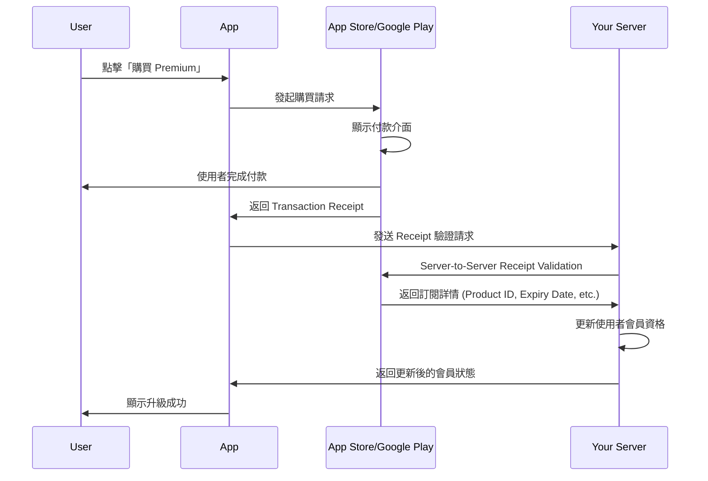
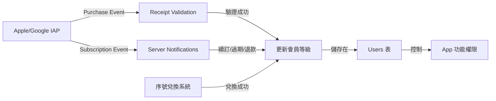
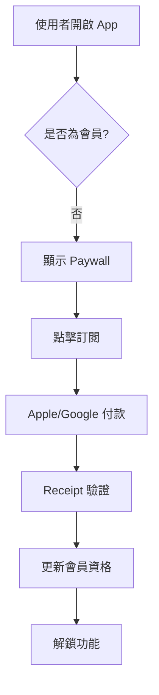
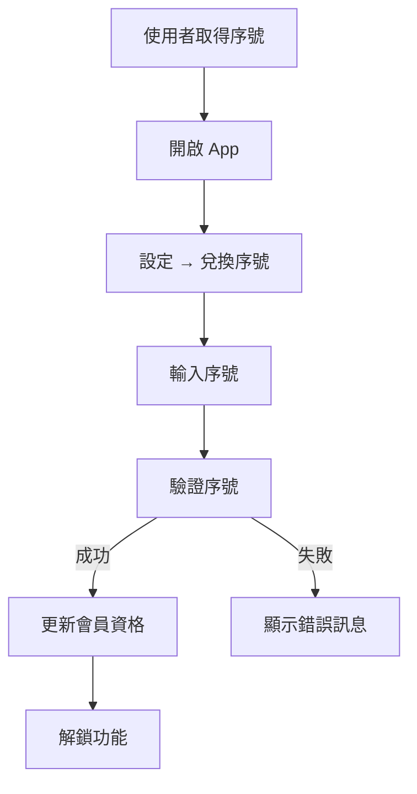
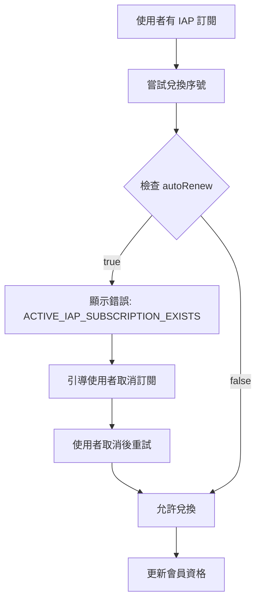

# IAP 與序號系統整合分析 (IAP vs Redeem Code Integration)

> **建立日期**: 2025-11-23  
> **問題來源**: 序號兌換系統與 Apple/Google Play 訂閱的整合策略  
> **關鍵議題**: 會員資格來源衝突、權限同步、退款處理

---

## 目錄

1. [核心問題釐清](#1-核心問題釐清)
2. [Apple/Google IAP 運作機制](#2-applegoogle-iap-運作機制)
3. [IAP 與自有會員系統的關聯](#3-iap-與自有會員系統的關聯)
4. [序號兌換與 IAP 的衝突情境](#4-序號兌換與-iap-的衝突情境)
5. [資料模型擴充建議](#5-資料模型擴充建議)
6. [技術整合方案](#6-技術整合方案)
7. [RevenueCat 整合策略](#7-revenuecat-整合策略)
8. [Apple/Google 政策合規](#8-applegoogle-政策合規)
9. [實作建議與最佳實踐](#9-實作建議與最佳實踐)

---

## 1. 核心問題釐清

### 1.1 您的問題拆解

| 問題 | 答案預覽 |
|------|----------|
| **Apple/Google 與會員等級的關聯在哪？** | 僅在「購買行為發生時」和「訂閱狀態變更時」有關聯 |
| **只有金流抽成嗎？** | ❌ 不只！還包括：訂閱狀態驗證、退款處理、續訂管理 |
| **需要告訴 Apple/Google 使用者等級嗎？** | ❌ 不需要！等級管理完全在您的後端 |
| **序號兌換後需處理什麼？** | ⚠️ 需防止會員資格衝突、處理訂閱覆蓋邏輯 |

---

### 1.2 關鍵認知

> [!IMPORTANT]
> **Apple/Google 只管「訂閱商品」，不管「會員等級」**
> 
> - Apple/Google 知道: 使用者購買了「Premium Monthly Subscription」商品
> - Apple/Google 不知道: 使用者在您 App 中是「Tier 1」還是「Tier 2」
> - **會員等級映射完全由您的後端決定**

---

## 2. Apple/Google IAP 運作機制

### 2.1 IAP 購買流程



---

### 2.2 Apple/Google 管理的內容

| 項目 | Apple/Google 負責 | 您的後端負責 |
|------|-------------------|-------------|
| **付款處理** | ✅ 完全管理 | ❌ 不涉及 |
| **訂閱商品定義** | ✅ 在 App Store Connect/Google Play Console 設定 | ❌ |
| **訂閱狀態** | ✅ 維護訂閱到期日、自動續訂狀態 | ❌ |
| **Receipt 驗證** | ✅ 提供驗證 API | ✅ 呼叫驗證 API |
| **會員等級映射** | ❌ 不知道 | ✅ 完全管理 |
| **序號兌換** | ❌ 不知道 | ✅ 完全管理 |
| **功能權限控制** | ❌ 不知道 | ✅ 完全管理 |
| **退款處理** | ✅ 使用者可申請退款 | ✅ 需監聽退款事件 |

---

### 2.3 訂閱商品 vs 會員等級

**Apple/Google 商品定義範例** (在 App Store Connect 設定):

| Product ID | Display Name | Duration | Price |
|------------|--------------|----------|-------|
| `com.yourapp.premium.monthly` | Premium Monthly | 1 Month | $9.99 |
| `com.yourapp.premium.yearly` | Premium Yearly | 1 Year | $99.99 |
| `com.yourapp.pro.monthly` | Pro Monthly | 1 Month | $19.99 |

**您的會員等級映射** (在您的後端邏輯):

```typescript
function mapProductToTier(productId: string): number {
  const mapping = {
    'com.yourapp.premium.monthly': 1,  // Tier 1 = Premium
    'com.yourapp.premium.yearly': 1,   // Tier 1 = Premium
    'com.yourapp.pro.monthly': 2,      // Tier 2 = Pro
    'com.yourapp.pro.yearly': 2,
  };
  return mapping[productId] || 0;
}
```

> **重點**: Apple/Google 完全不知道 Tier 1 或 Tier 2 的概念，這只是您內部的業務邏輯。

---

## 3. IAP 與自有會員系統的關聯

### 3.1 關聯發生的時間點

#### ① 購買發生時 (Purchase Event)
```typescript
// App 端收到購買成功
const transaction = await IAP.purchaseProduct('com.yourapp.premium.monthly');

// 發送 Receipt 到後端驗證
const response = await fetch('/api/v1/iap/verify', {
  method: 'POST',
  body: JSON.stringify({
    userId: currentUser.uid,
    receipt: transaction.transactionReceipt,
    platform: 'ios' // or 'android'
  })
});

// 後端驗證後更新會員資格
// Users.currentTier = 1
// Users.subscriptionEndDate = expiryDate
// Users.subscriptionSource = 'apple_iap'
```

#### ② 訂閱狀態變更時 (Subscription Event)
- **自動續訂成功**: 需延長 `subscriptionEndDate`
- **訂閱過期**: 需降級 `currentTier`
- **退款發生**: 需撤銷會員資格
- **升級/降級**: 需調整 `currentTier`

---

### 3.2 Server-to-Server Notifications (關鍵！)

> [!WARNING]
> **不能只依賴 App 端驗證！必須監聽伺服器通知**

Apple 和 Google 都提供 Webhook 通知機制，在訂閱狀態變更時主動通知您的後端：

**Apple: App Store Server Notifications**
- Endpoint: 您提供的 HTTPS URL
- 事件類型: 
  - `DID_RENEW`: 自動續訂成功
  - `DID_FAIL_TO_RENEW`: 續訂失敗 (可能是付款失敗)
  - `REFUND`: 使用者獲得退款
  - `REVOKE`: 訂閱被撤銷

**Google: Real-time Developer Notifications (RTDN)**
- 透過 Google Cloud Pub/Sub
- 事件類型:
  - `SUBSCRIPTION_RENEWED`: 訂閱續期
  - `SUBSCRIPTION_CANCELED`: 訂閱取消
  - `SUBSCRIPTION_REVOKED`: 訂閱撤銷 (通常是退款)

---

### 3.3 關聯點總結



**關鍵**: IAP 和序號系統都是「會員資格的來源」，最終都會更新同一張 `Users` 表。

---

## 4. 序號兌換與 IAP 的衝突情境

### 4.1 衝突情境矩陣

| 情境 | 使用者現況 | 執行動作 | 潛在問題 | 建議處理 |
|------|-----------|----------|---------|---------|
| **A** | 有 Apple IAP 訂閱 (Tier 1, 剩 20 天) | 兌換 Tier 1 序號 (30 天) | 訂閱與序號重疊 | 禁止兌換 或 展期至訂閱結束後 |
| **B** | 有 Apple IAP 訂閱 (Tier 1) | 兌換 Tier 2 序號 | IAP 會自動續訂 Tier 1，造成降級 | 警告使用者先取消訂閱 |
| **C** | 使用序號升級至 Tier 1 | 在 App Store 購買 Tier 1 訂閱 | 重複付費 | 允許，IAP 訂閱到期後繼續享有會員 |
| **D** | 使用序號升級至 Tier 2 | 在 App Store 購買 Tier 1 訂閱 | IAP 較低等級 | 禁止降級 或 提示使用者 |
| **E** | 有 Apple IAP 訂閱 | 獲得退款 | 會員資格應撤銷，但序號不可退 | 需記錄資格來源 |

---

### 4.2 最棘手的問題：自動續訂衝突

**情境 B 詳細說明**:

1. **初始狀態**:
   - 使用者透過 Apple IAP 訂閱 Premium (Tier 1)
   - `subscriptionSource: 'apple_iap'`
   - `autoRenew: true`
   - `subscriptionEndDate: 2025-12-31`

2. **使用者兌換 Pro 序號** (Tier 2, 30 天):
   - 您的系統升級使用者至 Tier 2
   - `currentTier: 2`
   - `subscriptionEndDate: 2026-01-30`

3. **問題發生**:
   - 2025-12-31 Apple 自動續訂 Premium
   - Apple 發送 `DID_RENEW` 通知
   - 您的後端收到通知，執行邏輯...
   - ❓ **應該怎麼辦？**
     - Option A: 覆蓋為 Tier 1 → ❌ 使用者損失序號價值
     - Option B: 忽略續訂 → ❌ 使用者付費卻沒效果，可能申訴
     - Option C: 退款給使用者 → ❌ 技術上無法自動退款

---

### 4.3 建議解決方案

#### 方案 1: 禁止混用 (最簡單)

**規則**:
- 若使用者有**啟用中的 IAP 自動訂閱**，禁止兌換序號
- 錯誤訊息: 「您目前已有 Apple/Google Play 訂閱，請先取消自動續訂後再兌換序號」

**優點**:
- ✅ 邏輯簡單，不會有衝突
- ✅ 避免使用者困惑

**缺點**:
- ⚠️ 使用者體驗較差，需手動操作
- ⚠️ 可能降低序號兌換率

**實作**:
```typescript
async function validateRedeemCode(userId: string, code: string) {
  const user = await getUser(userId);
  
  // 檢查是否有啟用中的 IAP 訂閱
  if (user.subscriptionSource === 'apple_iap' || user.subscriptionSource === 'google_iap') {
    if (user.autoRenew === true) {
      throw new Error('ACTIVE_IAP_SUBSCRIPTION_EXISTS');
    }
  }
  
  // ... 繼續驗證邏輯
}
```

---

#### 方案 2: 智慧覆蓋 (推薦)

**規則**:
1. **同等級**: 序號展期至 IAP 訂閱結束後
2. **升級**: 允許兌換，但警告「下次續訂仍會降級」
3. **降級**: 禁止兌換

**實作**:
```typescript
async function handleRedeemWithIAP(user: User, code: RedeemCode) {
  const hasActiveIAP = user.subscriptionSource?.includes('_iap') && user.autoRenew;
  
  if (!hasActiveIAP) {
    // 標準兌換流程
    return standardRedeemFlow(user, code);
  }
  
  // 有啟用中的 IAP
  const iapTier = user.currentTier;
  const codeTier = code.targetTier;
  
  if (codeTier === iapTier) {
    // 同等級：展期至 IAP 訂閱結束後
    const newEndDate = user.subscriptionEndDate + (code.durationDays * 86400000);
    return {
      currentTier: iapTier,
      subscriptionEndDate: newEndDate,
      message: '序號已成功兌換，將在您的訂閱結束後生效'
    };
  }
  
  if (codeTier > iapTier) {
    // 升級：允許，但發出警告
    return {
      currentTier: codeTier,
      subscriptionEndDate: Date.now() + (code.durationDays * 86400000),
      subscriptionSource: 'redeem_code',
      warning: '提醒：您的 Apple/Google 訂閱仍在執行，下次續訂時會降級。建議先取消自動續訂。'
    };
  }
  
  if (codeTier < iapTier) {
    // 降級：禁止
    throw new Error('CANNOT_DOWNGRADE_WITH_ACTIVE_IAP');
  }
}
```

---

#### 方案 3: 分離追蹤 (最靈活)

**資料模型設計**:

新增 `EntitlementSources` 表，記錄所有會員資格來源：

```typescript
interface EntitlementSource {
  id: string;
  userId: string;
  source: 'apple_iap' | 'google_iap' | 'redeem_code' | 'promo';
  sourceId: string; // Transaction ID 或 Code ID
  tier: number;
  startDate: number;
  endDate: number;
  isActive: boolean;
  autoRenew: boolean;
}
```

**邏輯**:
- 使用者可同時擁有多個資格來源
- 顯示等級永遠取「最高有效等級」
- IAP 續訂不影響序號資格

**優點**:
- ✅ 最靈活，支援複雜情境
- ✅ 使用者體驗最佳

**缺點**:
- ⚠️ 實作複雜度高
- ⚠️ 需處理「多來源過期」的邏輯

---

### 4.4 推薦策略 (MVP)

**階段 1 (MVP)**: 採用 **方案 1 (禁止混用)**
- 簡單可靠
- 快速上線
- 使用者教育成本低

**階段 2 (迭代)**: 升級至 **方案 2 (智慧覆蓋)**
- 改善使用者體驗
- 根據實際使用數據調整

**未來 (可選)**: **方案 3 (分離追蹤)**
- 若有複雜行銷需求 (如「贈送 1 個月試用但不影響現有訂閱」)

---

## 5. 資料模型擴充建議

### 5.1 Users 表新增欄位

在現有 `Users` 表中新增以下欄位以支援 IAP 整合：

| 欄位 | 型別 | 說明 |
|------|------|------|
| `subscriptionSource` | String \| Null | 會員資格來源 (`apple_iap`, `google_iap`, `redeem_code`, `promo`, `lifetime`) |
| `subscriptionPlatform` | String \| Null | 平台 (`ios`, `android`, `web`) |
| `iapProductId` | String \| Null | Apple/Google 商品 ID (例如: `com.yourapp.premium.monthly`) |
| `iapTransactionId` | String \| Null | 最後一次交易 ID (用於退款驗證) |
| `iapOriginalTransactionId` | String \| Null | 原始交易 ID (用於追蹤同一訂閱) |
| `autoRenew` | Boolean | 是否自動續訂 (IAP 訂閱專用) |
| `autoRenewProductId` | String \| Null | 下次續訂的商品 ID (可能升級/降級) |

---

### 5.2 IAP Transactions 表 (新增)

記錄所有 IAP 交易歷史：

```typescript
interface IAPTransaction {
  id: string;
  userId: string;
  platform: 'ios' | 'android';
  productId: string;
  transactionId: string;
  originalTransactionId: string;
  purchaseDate: number;
  expiresDate: number;
  isTrialPeriod: boolean;
  cancellationDate?: number;
  refundDate?: number;
  receipt: string; // 加密儲存
  verifiedAt: number;
  createdOn: number;
}
```

**用途**:
- 審計追蹤
- 退款處理
- 訂閱狀態歷史
- 收入分析

---

### 5.3 Subscription Events 表 (新增)

記錄所有訂閱事件（IAP 通知 + 序號兌換）：

```typescript
interface SubscriptionEvent {
  id: string;
  userId: string;
  eventType: string; // 'purchase', 'renew', 'cancel', 'refund', 'redeem', 'expire'
  source: 'apple_iap' | 'google_iap' | 'redeem_code';
  sourceId: string; // Transaction ID 或 Code ID
  previousTier: number;
  newTier: number;
  previousEndDate: number | null;
  newEndDate: number | null;
  eventData: object; // 原始通知 JSON
  processedAt: number;
  createdOn: number;
}
```

---

## 6. 技術整合方案

### 6.1 Receipt Validation Flow

#### iOS (Apple)

**Step 1: App 端購買**
```typescript
import * as IAP from 'react-native-iap';

async function purchasePremium() {
  try {
    const purchase = await IAP.requestPurchase('com.yourapp.premium.monthly');
    
    // 獲取 Receipt
    const receipt = await IAP.getReceiptIOS();
    
    // 發送至後端驗證
    await validateReceipt(receipt, 'ios');
  } catch (error) {
    console.error('Purchase failed', error);
  }
}
```

**Step 2: 後端驗證 (Firebase Cloud Function)**
```typescript
import axios from 'axios';

async function verifyAppleReceipt(receipt: string, isProduction: boolean) {
  const endpoint = isProduction
    ? 'https://buy.itunes.apple.com/verifyReceipt'
    : 'https://sandbox.itunes.apple.com/verifyReceipt';
  
  const response = await axios.post(endpoint, {
    'receipt-data': receipt,
    'password': process.env.APPLE_SHARED_SECRET // 從 App Store Connect 取得
  });
  
  if (response.data.status === 0) {
    // 驗證成功
    const latestReceipt = response.data.latest_receipt_info[0];
    
    return {
      productId: latestReceipt.product_id,
      transactionId: latestReceipt.transaction_id,
      originalTransactionId: latestReceipt.original_transaction_id,
      expiresDate: parseInt(latestReceipt.expires_date_ms),
      isTrialPeriod: latestReceipt.is_trial_period === 'true'
    };
  } else {
    throw new Error(`Apple receipt validation failed: ${response.data.status}`);
  }
}
```

---

#### Android (Google Play)

**使用 Google Play Developer API**:

```typescript
import { google } from 'googleapis';

async function verifyGooglePurchase(
  packageName: string,
  productId: string,
  purchaseToken: string
) {
  const androidPublisher = google.androidpublisher('v3');
  
  const auth = new google.auth.GoogleAuth({
    keyFile: './service-account-key.json',
    scopes: ['https://www.googleapis.com/auth/androidpublisher']
  });
  
  const authClient = await auth.getClient();
  
  const response = await androidPublisher.purchases.subscriptions.get({
    auth: authClient,
    packageName: packageName,
    subscriptionId: productId,
    token: purchaseToken
  });
  
  return {
    expiryTimeMillis: parseInt(response.data.expiryTimeMillis),
    autoRenewing: response.data.autoRenewing,
    orderId: response.data.orderId
  };
}
```

---

### 6.2 Server Notifications 處理

#### Apple Webhook Endpoint

```typescript
// Cloud Function: /api/v1/webhooks/apple
export async function handleAppleNotification(req, res) {
  const notification = req.body;
  
  // 驗證簽名 (重要！)
  if (!verifyAppleSignature(notification)) {
    return res.status(401).send('Invalid signature');
  }
  
  const notificationType = notification.notification_type;
  const latestReceipt = notification.latest_receipt_info;
  const userId = await getUserByOriginalTransactionId(
    latestReceipt.original_transaction_id
  );
  
  switch (notificationType) {
    case 'DID_RENEW':
      await handleSubscriptionRenewed(userId, latestReceipt);
      break;
    case 'DID_FAIL_TO_RENEW':
      await handleSubscriptionFailedToRenew(userId, latestReceipt);
      break;
    case 'REFUND':
      await handleRefund(userId, latestReceipt);
      break;
    case 'CANCEL':
      await handleSubscriptionCanceled(userId, latestReceipt);
      break;
  }
  
  res.status(200).send('OK');
}

async function handleRefund(userId: string, receipt: any) {
  // 記錄事件
  await db.collection('SubscriptionEvents').add({
    userId,
    eventType: 'refund',
    source: 'apple_iap',
    sourceId: receipt.transaction_id,
    eventData: receipt,
    processedAt: Date.now()
  });
  
  // 撤銷會員資格（僅限透過 IAP 取得的資格）
  const user = await getUser(userId);
  
  if (user.subscriptionSource === 'apple_iap' 
      && user.iapOriginalTransactionId === receipt.original_transaction_id) {
    await db.collection('Users').doc(userId).update({
      currentTier: 0,
      subscriptionStatus: 'refunded',
      subscriptionEndDate: null,
      updatedOn: Date.now()
    });
    
    // 通知使用者
    await sendPushNotification(userId, {
      title: '訂閱已退款',
      body: '您的會員資格已被撤銷'
    });
  }
}
```

---

#### Google Pub/Sub 處理

```typescript
// Cloud Function: Pub/Sub Trigger
export async function handleGoogleNotification(message, context) {
  const notification = JSON.parse(
    Buffer.from(message.data, 'base64').toString()
  );
  
  const subscriptionNotification = notification.subscriptionNotification;
  const notificationType = subscriptionNotification.notificationType;
  const purchaseToken = subscriptionNotification.purchaseToken;
  
  // 驗證購買
  const purchase = await verifyGooglePurchase(
    'com.yourapp',
    subscriptionNotification.subscriptionId,
    purchaseToken
  );
  
  const userId = await getUserByPurchaseToken(purchaseToken);
  
  switch (notificationType) {
    case 1: // SUBSCRIPTION_RECOVERED
    case 2: // SUBSCRIPTION_RENEWED
      await handleSubscriptionRenewed(userId, purchase);
      break;
    case 3: // SUBSCRIPTION_CANCELED
      await handleSubscriptionCanceled(userId, purchase);
      break;
    case 12: // SUBSCRIPTION_REVOKED (退款)
      await handleRefund(userId, purchase);
      break;
  }
}
```

---

## 7. RevenueCat 整合策略

### 7.1 為什麼使用 RevenueCat？

RevenueCat 是一個訂閱管理中台服務，幫您處理：
- ✅ 統一 iOS 和 Android 的 IAP SDK
- ✅ 自動處理 Receipt Validation
- ✅ 自動監聽 Apple/Google Webhooks
- ✅ 提供跨平台訂閱狀態 API
- ✅ 收入分析儀表板

---

### 7.2 RevenueCat 與您的會員系統整合

**架構**:

```
App (RevenueCat SDK) 
  ↓ (購買)
RevenueCat Server
  ↓ (Webhook)
Your Firebase Cloud Function
  ↓ (更新)
Firestore Users 表
```

---

### 7.3 RevenueCat Webhook 處理

```typescript
// Cloud Function: /api/v1/webhooks/revenuecat
export async function handleRevenueCatWebhook(req, res) {
  const event = req.body.event;
  
  // 驗證 Webhook (使用 RevenueCat 提供的 API Key)
  const isValid = verifyRevenueCatSignature(req);
  if (!isValid) {
    return res.status(401).send('Invalid signature');
  }
  
  const userId = event.app_user_id; // RevenueCat User ID (應與 Firebase UID 相同)
  const productId = event.product_id;
  const expiresDate = new Date(event.expiration_at_ms).getTime();
  
  switch (event.type) {
    case 'INITIAL_PURCHASE':
    case 'RENEWAL':
    case 'NON_RENEWING_PURCHASE':
      await handlePurchase(userId, productId, expiresDate, event);
      break;
      
    case 'CANCELLATION':
      await handleCancellation(userId, event);
      break;
      
    case 'BILLING_ISSUE':
      await handleBillingIssue(userId, event);
      break;
      
    case 'PRODUCT_CHANGE':
      await handleProductChange(userId, event);
      break;
  }
  
  res.status(200).send('OK');
}

async function handlePurchase(
  userId: string,
  productId: string,
  expiresDate: number,
  event: any
) {
  const tier = mapProductToTier(productId);
  const platform = event.store === 'APP_STORE' ? 'ios' : 'android';
  const source = event.store === 'APP_STORE' ? 'apple_iap' : 'google_iap';
  
  // 記錄交易
  await db.collection('IAPTransactions').add({
    userId,
    platform,
    productId,
    transactionId: event.transaction_id,
    originalTransactionId: event.original_transaction_id,
    purchaseDate: new Date(event.purchased_at_ms).getTime(),
    expiresDate,
    isTrialPeriod: event.is_trial_period,
    receipt: event.original_app_user_id, // 或其他識別資訊
    verifiedAt: Date.now(),
    createdOn: Date.now()
  });
  
  // 更新使用者會員資格
  const user = await getUser(userId);
  
  // 檢查是否有衝突 (序號兌換)
  if (user.subscriptionSource === 'redeem_code' && user.currentTier >= tier) {
    // 使用者已透過序號獲得更高等級
    // 選項 1: 不覆蓋，保留序號資格
    // 選項 2: 記錄 IAP，但不立即生效
    console.warn('User has higher tier from redeem code, IAP pending');
    return;
  }
  
  // 更新會員資格
  await db.collection('Users').doc(userId).update({
    currentTier: tier,
    subscriptionStatus: 'active',
    subscriptionEndDate: expiresDate,
    subscriptionSource: source,
    subscriptionPlatform: platform,
    iapProductId: productId,
    iapTransactionId: event.transaction_id,
    iapOriginalTransactionId: event.original_transaction_id,
    autoRenew: !event.is_trial_period && event.will_renew,
    updatedOn: Date.now()
  });
  
  // 記錄事件
  await db.collection('SubscriptionEvents').add({
    userId,
    eventType: 'purchase',
    source,
    sourceId: event.transaction_id,
    previousTier: user.currentTier,
    newTier: tier,
    previousEndDate: user.subscriptionEndDate,
    newEndDate: expiresDate,
    eventData: event,
    processedAt: Date.now(),
    createdOn: Date.now()
  });
}
```

---

### 7.4 序號兌換時檢查 RevenueCat 狀態

```typescript
import Purchases from 'react-native-purchases';

async function checkActiveSubscriptionBeforeRedeem(userId: string) {
  try {
    // 從 RevenueCat 獲取最新訂閱狀態
    const customerInfo = await Purchases.getCustomerInfo();
    
    const activeEntitlements = customerInfo.activeSubscriptions;
    
    if (activeEntitlements.length > 0) {
      // 使用者有啟用中的 IAP 訂閱
      const productId = activeEntitlements[0];
      const willRenew = customerInfo.entitlements.active[productId].willRenew;
      
      if (willRenew) {
        throw new Error('ACTIVE_IAP_SUBSCRIPTION_EXISTS');
      }
    }
  } catch (error) {
    console.error('Failed to check RevenueCat status', error);
    // 決定是否允許兌換（容錯性）
  }
}
```

---

## 8. Apple/Google 政策合規

### 8.1 Apple App Store 審核指南

> [!CAUTION]
> **重要合規要求**

#### ① 不可繞過 IAP (指南 3.1.1)

**禁止**:
- ❌ 在 App 內引導使用者到外部網站購買訂閱
- ❌ 在 App 內顯示「官網購買更便宜」的訊息
- ❌ 提供不使用 IAP 的付款方式 (信用卡、PayPal 等)

**允許**:
- ✅ 序號兌換功能（只要不涉及直接金流）
- ✅ 行銷活動贈送序號
- ✅ 企業大量採購序號

**關鍵**: 序號必須是「免費取得」或「在 App 外部銷售」。

---

#### ② 序號兌換的合規做法

**✅ 合規範例**:
```
【設定】→【兌換序號】
「請輸入您的序號以兌換會員資格」
[輸入框]
[兌換按鈕]
```

**❌ 不合規範例**:
```
【付費方式選擇】
○ App Store 訂閱 ($9.99/月)
○ 購買序號 ($8.99/月，點此前往官網)  ← 這會被拒絕
```

---

#### ③ Reader App Exception (適用於特定類型 App)

若您的 App 屬於「Reader App」(如新聞、雜誌、音樂、影片串流)，可適用例外規定：
- ✅ 可引導使用者到外部網站訂閱
- ✅ 可使用帳號登入存取已購買內容

**判斷**: 您的記帳 App **不屬於** Reader App，必須遵守標準 IAP 規定。

---

### 8.2 Google Play 政策

#### ① Google Play 計費政策

**要求**:
- 所有「數位內容或服務」必須使用 Google Play Billing
- 包括：訂閱、功能解鎖、虛擬貨幣

**例外**:
- 實體商品
- 企業內部採購 (B2B)
- 慈善捐款

#### ② 序號兌換合規性

- ✅ 允許序號兌換
- ✅ 序號必須在 App 外部發放（行銷活動、合作夥伴等）
- ❌ 不可在 App 內銷售序號

---

### 8.3 合規建議總結

| 功能 | Apple 合規 | Google 合規 |
|------|-----------|------------|
| App 內訂閱 (IAP) | ✅ 必須使用 | ✅ 必須使用 |
| 序號兌換 | ✅ 允許 | ✅ 允許 |
| 行銷活動贈送序號 | ✅ 允許 | ✅ 允許 |
| App 內購買序號 | ❌ 禁止 | ❌ 禁止 |
| 引導至外部購買 | ❌ 禁止 | ❌ 禁止 |
| 企業大量採購序號 | ✅ 允許 | ✅ 允許 |

---

## 9. 實作建議與最佳實踐

### 9.1 MVP 階段建議 (最小可行方案)

#### Phase 1: 基礎 IAP 整合

**優先級 P0**:
- [ ] 整合 RevenueCat SDK
- [ ] 設定 Apple/Google 訂閱商品
- [ ] 實作 Paywall UI
- [ ] 處理 RevenueCat Webhook 更新會員資格
- [ ] 基本 Receipt Validation

**資料模型**:
- 在 `Users` 表新增必要欄位 (`subscriptionSource`, `iapProductId`, `autoRenew`)

---

#### Phase 2: 序號系統整合

**優先級 P1**:
- [ ] 實作序號兌換 API
- [ ] 新增「有啟用中 IAP 訂閱時禁止兌換」檢查
- [ ] UI 提示：「請先取消自動續訂」

**錯誤訊息範例**:
```json
{
  "success": false,
  "errorCode": "ACTIVE_IAP_SUBSCRIPTION_EXISTS",
  "message": "您目前已有 Apple/Google Play 訂閱正在運行中",
  "details": {
    "currentSource": "apple_iap",
    "currentTier": 1,
    "subscriptionEndDate": 1735689600000,
    "autoRenew": true
  },
  "action": {
    "title": "如何取消訂閱？",
    "url": "https://support.apple.com/zh-tw/HT202039"
  }
}
```

---

#### Phase 3: 進階處理 (迭代)

**優先級 P2**:
- [ ] 退款事件處理
- [ ] 訂閱升級/降級處理
- [ ] 智慧覆蓋邏輯（允許混用）
- [ ] 會員資格來源追蹤分析

---

### 9.2 使用者流程設計

#### 流程 1: 純 IAP 訂閱



---

#### 流程 2: 純序號兌換



---

#### 流程 3: 混合情境 (有 IAP + 兌換序號)



---

### 9.3 UI/UX 建議

#### ① Paywall Screen 設計

```typescript
// PaywallScreen.tsx
function PaywallScreen() {
  const [activeIAPSubscription, setActiveIAPSubscription] = useState(null);
  
  useEffect(() => {
    checkRevenueCatStatus();
  }, []);
  
  return (
    <View>
      <Text>升級至 Premium</Text>
      
      {/* IAP 訂閱選項 */}
      <SubscriptionOptions />
      
      {/* 序號兌換入口 */}
      <TouchableOpacity onPress={() => navigation.navigate('RedeemCode')}>
        <Text>已有序號？點此兌換</Text>
      </TouchableOpacity>
      
      {/* 已有訂閱的提示 */}
      {activeIAPSubscription && (
        <Banner>
          您目前已訂閱 {activeIAPSubscription.productId}
          到期日: {formatDate(activeIAPSubscription.expiresDate)}
        </Banner>
      )}
    </View>
  );
}
```

---

#### ② RedeemCodeScreen 警告設計

```typescript
// RedeemCodeScreen.tsx
function RedeemCodeScreen() {
  const [hasActiveIAP, setHasActiveIAP] = useState(false);
  
  useEffect(() => {
    checkActiveIAPSubscription();
  }, []);
  
  return (
    <View>
      {hasActiveIAP && (
        <Alert variant="warning">
          ⚠️ 您目前有進行中的訂閱，建議先取消自動續訂再兌換序號
          <LinkButton onPress={openCancelSubscriptionGuide}>
            如何取消？
          </LinkButton>
        </Alert>
      )}
      
      <TextField
        placeholder="XXXX-XXXX-XXXX"
        value={code}
        onChange={setCode}
      />
      
      <Button onPress={handleRedeem}>
        兌換序號
      </Button>
    </View>
  );
}
```

---

### 9.4 測試策略

#### ① 沙盒測試

**Apple**:
- 在 App Store Connect 建立沙盒測試帳號
- 使用沙盒帳號測試購買流程
- 驗證 Receipt Validation

**Google**:
- 在 Google Play Console 新增測試使用者
- 使用測試信用卡
- 驗證訂閱續訂/取消

---

#### ② 關鍵測試案例

| Test Case | 步驟 | 預期結果 |
|-----------|------|---------|
| **TC-01** | IAP 購買 Premium | 使用者升級至 Tier 1 |
| **TC-02** | 兌換 Premium 序號 (無 IAP) | 使用者升級至 Tier 1 |
| **TC-03** | 有啟用中 IAP 時兌換序號 | 顯示錯誤：`ACTIVE_IAP_SUBSCRIPTION_EXISTS` |
| **TC-04** | 取消 IAP 後兌換序號 | 允許兌換，更新會員資格 |
| **TC-05** | IAP 訂閱自動續訂 | Webhook 觸發，延長 `subscriptionEndDate` |
| **TC-06** | IAP 訂閱退款 | Webhook 觸發，撤銷會員資格 |
| **TC-07** | 序號到期但有 IAP | 顯示 IAP 訂閱資格 |
| **TC-08** | IAP 到期但有序號 | 顯示序號資格 |

---

### 9.5 監控與報警

#### 關鍵指標

**訂閱健康度**:
- IAP 新訂閱數 / 日
- 序號兌換數 / 日
- 退款率
- 續訂率
- 流失率

**系統健康度**:
- Webhook 處理延遲
- Receipt Validation 失敗率
- 序號驗證失敗率

#### 報警設置

```typescript
// Cloud Function: 監控退款率
export async function monitorRefundRate() {
  const last24h = Date.now() - 86400000;
  
  const refundCount = await db.collection('SubscriptionEvents')
    .where('eventType', '==', 'refund')
    .where('createdOn', '>', last24h)
    .count()
    .get();
  
  const purchaseCount = await db.collection('SubscriptionEvents')
    .where('eventType', '==', 'purchase')
    .where('createdOn', '>', last24h)
    .count()
    .get();
  
  const refundRate = refundCount.data().count / purchaseCount.data().count;
  
  if (refundRate > 0.05) { // 超過 5%
    await sendAlertToSlack({
      message: `🚨 退款率異常：${(refundRate * 100).toFixed(2)}%`,
      refundCount: refundCount.data().count,
      purchaseCount: purchaseCount.data().count
    });
  }
}
```

---

## 總結

### 核心要點回顧

1. **Apple/Google 只管訂閱商品，不管會員等級**
   - 等級映射完全由您的後端決定

2. **關聯點有三個**:
   - ① 購買時的 Receipt Validation
   - ② 訂閱狀態變更的 Server Notifications
   - ③ 金流抽成 (Apple 30%, Google 15-30%)

3. **不需要告訴 Apple/Google 使用者等級**
   - 他們只知道購買記錄，不知道業務邏輯

4. **序號兌換的關鍵問題**: 與 IAP 自動續訂的衝突
   - **MVP 建議**: 禁止混用
   - **進階方案**: 智慧覆蓋或分離追蹤

5. **必須監聽 Server-to-Server Notifications**
   - 處理退款、續訂失敗、訂閱取消

6. **合規性**:
   - ✅ 序號兌換是合規的
   - ❌ 不可在 App 內販售序號或引導外部付款

---

### 行動項目 (MVP)

- [ ] 在 `Users` 表新增 IAP 相關欄位
- [ ] 整合 RevenueCat SDK
- [ ] 實作 RevenueCat Webhook Handler
- [ ] 序號兌換 API 加入「檢查啟用中 IAP」邏輯
- [ ] 設計錯誤提示 UI
- [ ] 測試沙盒購買流程
- [ ] 文件化取消訂閱流程供使用者參考

---

**文件結束**
