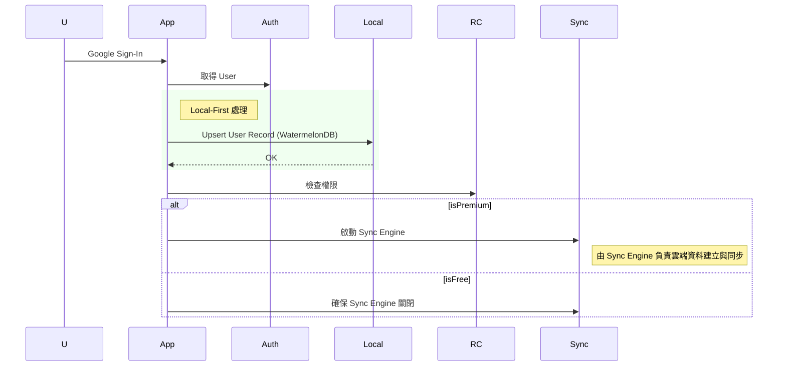

# 登入流程矛盾分析報告

> **日期**: 2025-11-27
> **主題**: 全域互動總覽 vs. 首次登入邏輯之矛盾分析
> **狀態**: 待確認

## 1. 問題描述

在比對 `no1_interaction_flow.md` (全域互動總覽) 與 `no2_first_login_flow.md` (首次登入邏輯) 後，發現兩者在 **「使用者資料建立 (User Creation)」** 的核心邏輯上存在根本性的矛盾。

## 2. 矛盾點分析

| 比較維度 | `no1_interaction_flow.md` (總覽) | `no2_first_login_flow.md` (詳細邏輯) |
| :--- | :--- | :--- |
| **核心架構** | **Cloud-First (雲端優先)** | **Local-First (本地優先)** |
| **資料建立時機** | 登入後 **立即** 連線 Firestore 建立 User Profile。 | 登入後 **優先** 在 WatermelonDB 建立/更新使用者記錄。 |
| **強健性機制** | 使用 `Loop 3 Times` 重試機制，確保雲端 Profile 建立成功。 | 依賴本地 DB 的原子性操作 (Atomic Upsert)，確保本地資料一定存在。 |
| **Tier 0 行為** | 未區分，暗示所有使用者皆需建立雲端 Profile。 | **明確區分**：Tier 0 使用者 **不啟動 Sync Engine**，完全不連線 Firestore。 |
| **寫入操作** | 直接呼叫 Firestore API (`App->>Cloud`). | 禁止直接寫入，改由 Sync Engine 負責 (若有權限)。 |

## 3. 影響評估

若依照 `no1_interaction_flow.md` (總覽) 實作：
1.  **違反 Local-First 原則**: 強制依賴網路才能完成登入流程。
2.  **增加成本**: Tier 0 免費使用者也會消耗 Firestore 寫入額度。
3.  **體驗不一致**: 離線登入將會失敗 (因為無法建立雲端 Profile)，與「離線可用」承諾相違背。

## 4. 建議解決方案

**採用 `no2_first_login_flow.md` 的 Local-First 邏輯為準。**

### 具體修改建議 (針對總覽文件)

1.  **移除** `App->>Cloud: 查詢/建立 User Profile` 的迴圈邏輯。
2.  **新增** `App->>Local: Ensure Local User` 的步驟。
3.  **調整** Sync Engine 啟動條件：
    *   僅在 `isPremium == true` 時啟動。
    *   由 Sync Engine 負責後續的雲端 Profile 同步 (若不存在則由 Sync Engine 上傳建立)。

### 修正後的虛擬流程

## 5. 補充分析：登入時機與使用者體驗 (UX)

針對「是否應強制 T0 使用者登入」的進一步分析：

### 5.1 技術層面：T0 是否需要 User Record？

*   **結論**: **不需要**。
*   **原因**:
    *   **權限判斷在 Client**: App 透過 RevenueCat SDK 直接與 Store 溝通，T0 狀態由本地 SDK 判斷，無需 Firestore 介入。
    *   **Webhook 依賴性**: Webhook 僅用於通知後端開啟 Sync 權限。T0 不需 Sync，因此後端無資料也無妨。
    *   **資料一致性**: 當使用者決定付費 (變為 T1) 時，App 會強制要求登入，此時再建立 User Record 即可完美銜接。

### 5.2 體驗層面：早登入 (Early) vs. 晚登入 (Contextual)

| 比較項目 | 情境 A：強制早登入 (Early Login) | 情境 B：情境式晚登入 (Contextual Login) |
| :--- | :--- | :--- |
| **流程** | 下載 -> **阻擋 (登入)** -> 首頁 -> 付費 | 下載 -> **直接使用 (Guest)** -> 付費/備份 -> **登入** |
| **優點** | 資料歸戶明確，行銷追蹤容易。 | **無縫體驗**，降低進入門檻，符合 Local-First 精神。 |
| **缺點** | **流失率高**，使用者未體驗價值即被阻擋；T0 登入後無備份功能，易產生困惑。 | 需處理「本地資料 -> 雲端帳號」的資料轉移 (Onboarding) 邏輯。 |
| **結論** | **不推薦** | **強烈推薦** |

### 5.3 建議流程 (Ideal Flow)

1.  **首次啟動**: **不登入**，直接進入 App (Guest Mode, T0)。
2.  **日常使用**: 資料存於本地 WatermelonDB。
3.  **觸發點**: 使用者點擊「訂閱 Premium」或「手動備份」。
4.  **登入引導**: 提示「為了確保雲端權益，請先登入」。
5.  **執行登入**: 登入後，將本地資料綁定至該帳號。
6.  **完成訂閱**: RevenueCat 通知後端，開啟 Sync Engine。

