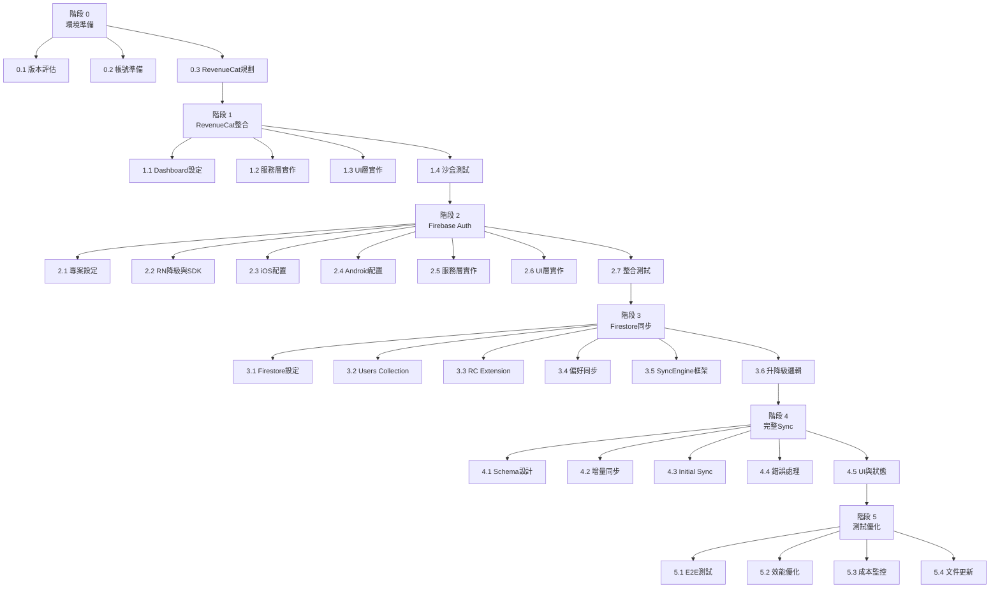

# Firebase & RevenueCat 串接施工計劃 - 詳細子階段

> **文件日期:** 2026-01-03  
> **版本:** v2.0 細分版  
> **母文件:** `firebase_revenuecat_integration_plan_20260103.md`

---

## 階段拆解總覽

原有 5 個階段拆解為 **23 個子階段**，平均每個子階段 1-3 天完成。



---

## 階段 0: 環境準備與風險評估

### 子階段 0.1: React Native 版本評估與降級

**預估時間:** 1-2 天

**工作內容:**
- 備份當前專案狀態
- 建立測試分支
- 降級至 RN 0.79.6
- 執行完整功能測試
- 記錄不相容問題
- 決策是否降級

**產出:**
- 版本降級決策文件
- 不相容清單
- 修復計劃

**驗收標準:**
- 所有現有功能正常運作
- 無 breaking changes
- 團隊同意降級方案

---

### 子階段 0.2: 開發者帳號準備

**預估時間:** 1 天

**工作內容:**
- 確認 Apple Developer Program 狀態
- 確認 Google Play Console 存取
- 準備 App Store Connect 訂閱設定頁面
- 準備測試帳號清單
- 設定沙盒測試環境

**產出:**
- 帳號存取權限確認表
- 測試帳號清單
- 沙盒環境設定文件

**驗收標準:**
- 可登入所有必要的開發者平台
- 測試帳號已建立
- 沙盒環境可用

---

### 子階段 0.3: RevenueCat 產品規劃

**預估時間:** 1 天

**工作內容:**
- 確認訂閱產品類型
- 確認定價策略
- 規劃免費試用設定
- 規劃 Entitlement 結構
- 設計降級策略

**產出:**
- 產品規格文件
- 定價策略表
- Entitlement 映射表

**驗收標準:**
- 產品規格明確
- 定價符合市場調研
- 降級邏輯清晰

---

## 階段 1: RevenueCat 基礎整合

### 子階段 1.1: RevenueCat Dashboard 設定

**預估時間:** 0.5 天

**工作內容:**
- 建立 RevenueCat 專案
- 連結 Apple App Store
- 連結 Google Play Store
- 建立月訂閱產品
- 建立年訂閱產品
- 設定免費試用期間
- 建立 Entitlement: premium
- 取得 API Keys

**產出:**
- RevenueCat 專案設定截圖
- API Keys 文件
- 產品 ID 列表

**驗收標準:**
- 所有產品已建立
- Entitlement 映射正確
- API Keys 已安全儲存

---

### 子階段 1.2: RevenueCat 服務層實作

**預估時間:** 1 天

**工作內容:**
- 更新 `revenueCat.ts`
- 移除 Mock 模式
- 實作 `getOfferings`
- 實作 `purchasePackage`
- 實作 `restorePurchases`
- 實作錯誤處理
- 實作離線邏輯
- 更新 `PremiumContext.tsx`
- 加入 `expirationDate` 追蹤
- 實作 `checkPremiumStatus`
- 實作離線 TTL 檢查

**產出:**
- 更新的 `revenueCat.ts`
- 更新的 `PremiumContext.tsx`
- 單元測試

**驗收標準:**
- 所有方法正確實作
- 錯誤處理完善
- 離線邏輯正確

---

### 子階段 1.3: PaywallScreen UI 實作

**預估時間:** 1 天

**工作內容:**
- 更新 `PaywallScreen.tsx`
- 串接 `getOfferings` API
- 動態顯示價格
- 實作購買按鈕
- 實作恢復購買按鈕
- 實作 Loading 狀態
- 實作錯誤提示
- 實作 Redirect Flow

**產出:**
- 更新的 `PaywallScreen.tsx`
- UI 測試案例

**驗收標準:**
- 價格動態顯示正確
- 購買流程順暢
- 錯誤提示清楚

---

### 子階段 1.4: RevenueCat 沙盒測試

**預估時間:** 1 天

**工作內容:**
- 建立 iOS TestFlight build
- 建立 Android Internal Testing build
- 測試沙盒購買
- 測試恢復購買
- 測試訂閱過期
- 測試離線權限檢查
- 記錄測試結果

**產出:**
- 測試報告
- 問題清單
- 修復計劃

**驗收標準:**
- 沙盒購買成功
- 權限狀態正確更新
- 離線檢查正常

---

## 階段 2: Firebase Auth 整合

### 子階段 2.1: Firebase 專案設定

**預估時間:** 0.5 天

**工作內容:**
- 建立 Firebase 專案
- 啟用 Authentication
- 設定 Google OAuth
- 註冊 iOS App
- 註冊 Android App
- 下載設定檔案
- 設定 OAuth 同意畫面

**產出:**
- Firebase 專案 URL
- `GoogleService-Info.plist`
- `google-services.json`
- OAuth Client IDs

**驗收標準:**
- Firebase 專案已建立
- OAuth 設定完成
- 設定檔案已下載

---

### 子階段 2.2: React Native 降級與 SDK 安裝

**預估時間:** 0.5 天

**工作內容:**
- 執行 RN 降級至 0.79.6
- 安裝 `@react-native-firebase/app@^23.4.0`
- 安裝 `@react-native-firebase/auth@^23.4.0`
- 安裝 `@react-native-firebase/firestore@^23.4.0`
- 安裝 `@react-native-google-signin/google-signin`
- 執行 `npm install`
- 測試 build

**產出:**
- 更新的 `package.json`
- 更新的 `package-lock.json`

**驗收標準:**
- 所有套件安裝成功
- 專案可成功 build
- 無版本衝突

---

### 子階段 2.3: iOS 專案配置

**預估時間:** 1 天

**工作內容:**
- 複製 `GoogleService-Info.plist` 至專案
- 更新 `Podfile`
- 加入 static frameworks 清單
- 設定 pre_install hook
- 明確宣告 Firebase pods
- 更新 `AppDelegate.swift`
- 匯入 Firebase modules
- 呼叫 `FirebaseApp.configure()`
- 設定 URL Schemes
- 執行 `pod install`
- 測試 iOS build

**產出:**
- 更新的 `Podfile`
- 更新的 `AppDelegate.swift`
- iOS build 成功

**驗收標準:**
- iOS 專案 build 成功
- Firebase 正確初始化
- 無編譯錯誤

---

### 子階段 2.4: Android 專案配置

**預估時間:** 0.5 天

**工作內容:**
- 複製 `google-services.json` 至 `android/app/`
- 更新 `android/build.gradle`
- 加入 Google Services plugin
- 更新 `android/app/build.gradle`
- 套用 plugin
- 設定 SHA-1 憑證
- 測試 Android build

**產出:**
- 更新的 Gradle 設定檔
- Android build 成功

**驗收標準:**
- Android 專案 build 成功
- Firebase 正確初始化
- 無編譯錯誤

---

### 子階段 2.5: Firebase Auth 服務層實作

**預估時間:** 1 天

**工作內容:**
- 更新 `firebase.ts`
- 移除 Mock 實作
- 實作 Firebase Auth 初始化
- 實作 `signInWithGoogle`
- 實作 `signOut`
- 實作 `onAuthStateChanged`
- 整合 Google Sign-In SDK
- 實作 Token 轉換
- 實作錯誤處理

**產出:**
- 更新的 `firebase.ts`
- Auth 服務單元測試

**驗收標準:**
- Auth 方法正確實作
- 錯誤處理完善
- Token 轉換正確

---

### 子階段 2.6: AuthContext 與 LoginScreen 實作

**預估時間:** 1 天

**工作內容:**
- 更新 `AuthContext.tsx`
- 連接 Firebase Auth
- 實作 `onAuthStateChanged` 訂閱
- 同步至 WatermelonDB
- 整合 RevenueCat identify
- 實作重試機制
- 更新 `LoginScreen.tsx`
- 建立 Google 登入按鈕
- 實作錯誤提示
- 實作 Loading 狀態
- 實作 Redirect Flow

**產出:**
- 更新的 `AuthContext.tsx`
- 更新的 `LoginScreen.tsx`
- UI 測試案例

**驗收標準:**
- 登入流程完整
- 錯誤處理清楚
- 重試機制正確

---

### 子階段 2.7: Firebase Auth 整合測試

**預估時間:** 1 天

**工作內容:**
- 測試 Google 登入流程
- 測試登出流程
- 測試網路錯誤處理
- 測試使用者資料同步
- 測試 RevenueCat 識別
- 測試跨裝置登入
- 記錄測試結果

**產出:**
- 測試報告
- 問題清單
- 修復計劃

**驗收標準:**
- 登入成功率 > 95%
- 使用者資料正確同步
- RevenueCat 綁定正確

---

## 階段 3: Firestore 資料同步

### 子階段 3.1: Firestore 基礎設定

**預估時間:** 0.5 天

**工作內容:**
- 啟用 Firestore Database
- 選擇資料庫區域
- 建立 Security Rules
- 設定 users collection 規則
- 建立基本索引
- 測試 Rules

**產出:**
- Firestore Security Rules 檔案
- 索引設定文件

**驗收標準:**
- Firestore 已啟用
- Security Rules 通過測試
- 索引已建立

---

### 子階段 3.2: Users Collection 實作

**預估時間:** 1 天

**工作內容:**
- 實作使用者建立邏輯
- 實作重試機制
- 實作 Schema 驗證
- 實作偏好設定欄位
- 測試使用者建立
- 測試查詢效能

**產出:**
- Users Collection 實作程式碼
- Schema 驗證規則

**驗收標準:**
- 使用者建立成功
- 重試機制正確
- 查詢效能良好

---

### 子階段 3.3: RevenueCat Firebase Extension 整合

**預估時間:** 0.5 天

**工作內容:**
- 安裝 RevenueCat Extension
- 設定 API Key
- 配置 Webhook
- 設定目標 Collection
- 測試權限同步
- 測試過期處理

**產出:**
- Extension 設定文件
- Webhook 測試報告

**驗收標準:**
- Extension 正確安裝
- 權限自動同步
- 過期自動移除

---

### 子階段 3.4: 偏好設定同步實作

**預估時間:** 1 天

**工作內容:**
- 實作本地寫入 Firestore
- 實作 Firestore Listener
- 實作衝突解決
- 實作 PreferenceContext 整合
- 測試跨裝置同步
- 測試離線處理

**產出:**
- 偏好同步程式碼
- 同步測試案例

**驗收標準:**
- 偏好變更即時同步
- 衝突解決正確
- 離線佇列正常

---

### 子階段 3.5: SyncEngine 基礎框架

**預估時間:** 1 天

**工作內容:**
- 建立 `syncEngine.ts`
- 實作 `start` 方法
- 實作 `stop` 方法
- 實作連線狀態檢查
- 實作 timestamp 比對
- 實作基礎上傳框架
- 實作基礎下載框架

**產出:**
- `syncEngine.ts` 檔案
- SyncEngine 架構文件

**驗收標準:**
- 啟動停止邏輯正確
- 連線檢查正常
- 框架完整

---

### 子階段 3.6: Premium 升降級邏輯

**預估時間:** 1 天

**工作內容:**
- 實作升級觸發邏輯
- 實作 Initial Sync 觸發
- 實作降級觸發邏輯
- 實作 Sync 停止邏輯
- 實作狀態通知
- 測試升級流程
- 測試降級流程

**產出:**
- 升降級邏輯程式碼
- 升降級測試報告

**驗收標準:**
- 升級觸發 Sync
- 降級停止 Sync
- 本地資料保留

---

## 階段 4: 完整同步引擎

### 子階段 4.1: Firestore Collections Schema 設計

**預估時間:** 1 天

**工作內容:**
- 設計 transactions schema
- 設計 accounts schema
- 設計 categories schema
- 設計 recurring_settings schema
- 設計索引策略
- 建立 Security Rules
- 測試 Rules

**產出:**
- Schema 設計文件
- Security Rules 更新
- 索引設定文件

**驗收標準:**
- Schema 符合需求
- Security Rules 通過測試
- 索引優化完成

---

### 子階段 4.2: 增量同步實作

**預估時間:** 2 天

**工作內容:**
- 實作上傳查詢邏輯
- 實作批次寫入
- 實作下載查詢邏輯
- 實作批次更新
- 實作 timestamp 更新
- 實作 LWW 衝突解決
- 測試增量同步

**產出:**
- 增量同步程式碼
- 同步測試案例

**驗收標準:**
- 僅同步變更資料
- 批次處理正確
- 衝突解決正確

---

### 子階段 4.3: Initial Sync 實作

**預估時間:** 2 天

**工作內容:**
- 實作觸發邏輯判斷
- 實作完整上傳邏輯
- 實作完整下載邏輯
- 實作合併邏輯
- 實作批次處理
- 實作進度追蹤
- 測試 Initial Sync

**產出:**
- Initial Sync 程式碼
- 進度追蹤 UI

**驗收標準:**
- 全量同步正確
- 批次處理高效
- 進度顯示準確

---

### 子階段 4.4: 錯誤處理與重試

**預估時間:** 1 天

**工作內容:**
- 實作網路錯誤處理
- 實作重試機制
- 實作指數退避
- 實作 Quota 錯誤處理
- 實作錯誤記錄
- 測試錯誤情境

**產出:**
- 錯誤處理程式碼
- 錯誤情境測試報告

**驗證標準:**
- 網路錯誤自動重試
- Quota 錯誤正確提示
- 錯誤記錄完整

---

### 子階段 4.5: SyncContext 與 UI 整合

**預估時間:** 1 天

**工作內容:**
- 建立 `SyncContext.tsx`
- 實作狀態管理
- 更新 SettingsScreen
- 加入同步狀態顯示
- 加入手動同步按鈕
- 加入上次同步時間
- 測試 UI 互動

**產出:**
- `SyncContext.tsx` 檔案
- 更新的 SettingsScreen
- UI 測試案例

**驗收標準:**
- 同步狀態即時顯示
- 手動同步正常
- UI 體驗良好

---

## 階段 5: 整合測試與優化

### 子階段 5.1: 端到端測試

**預估時間:** 2 天

**工作內容:**
- 執行情境 1: 新使用者流程
- 執行情境 2: 升級流程
- 執行情境 3: 過期處理
- 執行情境 4: 恢復購買
- 執行情境 5: 離線使用
- 記錄測試結果
- 修復發現問題

**產出:**
- E2E 測試報告
- 問題與修復清單

**驗收標準:**
- 所有情境通過
- 無重大問題
- 使用者體驗良好

---

### 子階段 5.2: 效能優化

**預估時間:** 1 天

**工作內容:**
- 分析 Firestore 讀寫次數
- 實作智慧同步頻率
- 優化 WatermelonDB 查詢
- 優化 App 啟動時間
- 實作延遲載入
- 測試效能改善

**產出:**
- 效能優化報告
- 優化程式碼

**驗收標準:**
- Firestore 讀寫降低 30%
- App 啟動時間 < 3 秒
- 同步效能提升

---

### 子階段 5.3: 成本監控與錯誤追蹤

**預估時間:** 1 天

**工作內容:**
- 整合 Firebase Crashlytics
- 設定錯誤追蹤
- 建立成本監控儀表板
- 設定 Firestore 預算警報
- 設定 RevenueCat 監控
- 建立關鍵指標追蹤

**產出:**
- Crashlytics 設定
- 成本監控儀表板
- 指標追蹤報告

**驗收標準:**
- Crashlytics 正常運作
- 成本監控準確
- 指標可視化

---

### 子階段 5.4: 文件更新與審查

**預估時間:** 1 天

**工作內容:**
- 更新 README
- 建立環境設定指南
- 建立故障排除文件
- 補充程式碼註解
- 建立 API 文件
- 審查 Security Rules
- 執行 Rules 測試

**產出:**
- 完整文件集
- Security Rules 審查報告

**驗收標準:**
- 文件完整清晰
- Security Rules 無漏洞
- 新成員可依文件上手

---

## 時程規劃建議

### 超快速路徑: 2 週

**適合:** 全職開發，已有 Firebase 經驗

- **週 1:** 階段 0 + 階段 1 + 階段 2.1~2.4
- **週 2:** 階段 2.5~2.7 + 階段 3 + 階段 4 + 階段 5

### 快速路徑: 4 週

**適合:** 全職開發，邊學邊做

- **週 1:** 階段 0 + 階段 1
- **週 2:** 階段 2
- **週 3:** 階段 3 + 階段 4.1
- **週 4:** 階段 4.2~4.5 + 階段 5

### 穩健路徑: 6 週

**適合:** 兼職開發，充分測試

- **週 1-2:** 階段 0 + 階段 1
- **週 3:** 階段 2.1~2.4
- **週 4:** 階段 2.5~2.7 + 階段 3.1~3.3
- **週 5:** 階段 3.4~3.6 + 階段 4
- **週 6:** 階段 5

### 謹慎路徑: 8 週

**適合:** 業餘時間開發，品質優先

- **週 1:** 階段 0
- **週 2:** 階段 1
- **週 3:** 階段 2.1~2.4
- **週 4:** 階段 2.5~2.7
- **週 5:** 階段 3.1~3.3
- **週 6:** 階段 3.4~3.6
- **週 7:** 階段 4
- **週 8:** 階段 5

---

## 階段依賴關係

### 必須依序執行

- 0.1 → 0.2 → 0.3
- 1.1 → 1.2 → 1.3 → 1.4
- 2.1 → 2.2 → 2.3 & 2.4 → 2.5 → 2.6 → 2.7
- 3.1 → 3.2 → 3.3 & 3.4 → 3.5 → 3.6
- 4.1 → 4.2 & 4.3 → 4.4 → 4.5
- 5.1 → 5.2 → 5.3 → 5.4

### 可平行執行

- 2.3 與 2.4 可同時進行
- 3.3 與 3.4 可同時進行
- 4.2 與 4.3 可同時進行
- 5.2 與 5.3 可同時進行

---

## 檢查清單模板

每個子階段完成後填寫：

```markdown
## 子階段 X.Y 完成檢查

- [ ] 所有工作項目已完成
- [ ] 產出文件已建立
- [ ] 驗收標準全部通過
- [ ] 程式碼已提交 Git
- [ ] 團隊已審查
- [ ] 可進入下一子階段
```

---

**文件結束**
