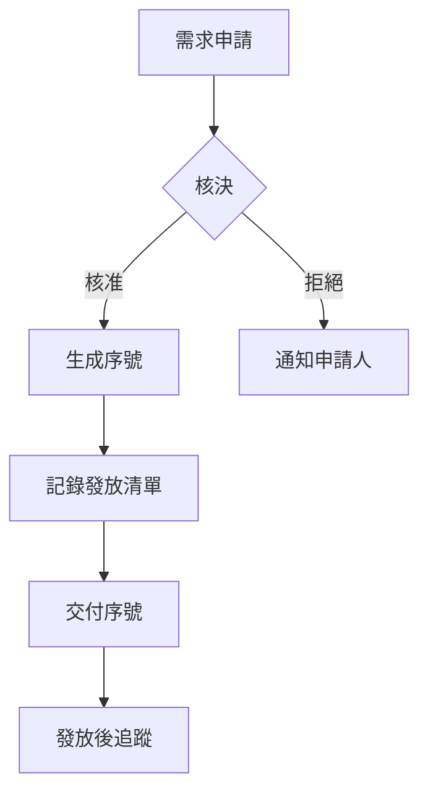

# 序號功能完整規格文件 (Redeem Code System Specification)

> **文件版本**: 1.0  
> **最後更新**: 2025-11-21  
> **負責模組**: User Management

---

## 目錄

1. [功能概述](#1-功能概述)
2. [資料模型](#2-資料模型)
3. [序號格式與生成邏輯](#3-序號格式與生成邏輯)
4. [序號驗證與兌換流程](#4-序號驗證與兌換流程)
5. [會員資格衝突處理](#5-會員資格衝突處理)
6. [API 規格](#6-api-規格)
7. [安全性與限流](#7-安全性與限流)
8. [營運管理方案](#8-營運管理方案)
9. [錯誤處理](#9-錯誤處理)

---

## 1. 功能概述

### 1.1 產品目標

序號兌換系統讓使用者透過輸入序號來獲得會員資格、延長訂閱期限或解鎖特定功能，同時提供營運團隊靈活的序號生成與管理能力，支援行銷活動與合作夥伴方案。

### 1.2 核心功能模組

| 模組 | 說明 |
|------|------|
| **序號生成系統** | 支援批次生成唯一且安全的序號 |
| **序號驗證系統** | 驗證序號有效性並執行兌換邏輯 |
| **兌換歷史追蹤** | 記錄所有兌換行為以供審計 |
| **會員資格管理** | 處理升級、展期與衝突情境 |
| **營運管理介面** | 提供序號管理與查詢功能 |

---

## 2. 資料模型

### 2.1 序號表 (RedeemCodes)

| 欄位 | 型別 | 約束 | 說明 |
|------|------|------|------|
| `id` | String | Primary Key, UUID | 序號唯一識別碼 |
| `code` | String | Not Null, Unique, Index | 序號字串 (例如: `ABCD-1234-EFGH`) |
| `codeType` | String | Not Null | 序號類型 (`tier_upgrade`, `trial_extension`, `feature_unlock`) |
| `targetTier` | Number \| Null | Nullable | 目標會員等級 (0=Free, 1=Premium, 2=Pro, 3=Enterprise) |
| `durationDays` | Number \| Null | Nullable | 有效期天數 (30, 90, 365, null=永久) |
| `maxRedemptions` | Number | Not Null, Default: 1 | 最大兌換次數 |
| `currentRedemptions` | Number | Not Null, Default: 0 | 目前已兌換次數 |
| `isActive` | Boolean | Not Null, Default: true | 序號是否啟用 |
| `expiresOn` | Number \| Null | Nullable, Unix Timestamp (ms) | 序號過期時間 |
| `createdBy` | String | Not Null | 建立者 (營運人員 ID/Email) |
| `createdOn` | Number | Not Null, Unix Timestamp (ms) | 建立時間 |
| `updatedOn` | Number | Not Null, Unix Timestamp (ms) | 最後更新時間 |
| `deletedOn` | Number \| Null | Nullable, Unix Timestamp (ms) | 軟刪除時間 |

**索引策略**:
- `code`: Unique Index (快速查詢)
- `isActive + expiresOn`: Composite Index (過期序號清理)
- `createdBy + createdOn`: Composite Index (營運查詢)

---

### 2.2 兌換歷史表 (RedemptionHistory)

| 欄位 | 型別 | 約束 | 說明 |
|------|------|------|------|
| `id` | String | Primary Key, UUID | 歷史記錄唯一識別碼 |
| `codeId` | String | Foreign Key, Not Null | 關聯至 `RedeemCodes.id` |
| `userId` | String | Foreign Key, Not Null | 關聯至 `Users` (Auth UID) |
| `redeemedOn` | Number | Not Null, Unix Timestamp (ms) | 兌換時間 |
| `previousTier` | Number \| Null | Nullable | 兌換前的會員等級 |
| `newTier` | Number | Not Null | 兌換後的會員等級 |
| `previousEndDate` | Number \| Null | Nullable, Unix Timestamp (ms) | 兌換前的訂閱到期日 |
| `subscriptionEndDate` | Number | Not Null, Unix Timestamp (ms) | 兌換後的訂閱到期日 |

**索引策略**:
- `userId + redeemedOn`: Composite Index (使用者兌換歷史)
- `codeId`: Index (序號使用情況追蹤)

---

### 2.3 使用者表擴充 (Users - 需補齊欄位)

在現有 `Users` 表中需新增以下欄位以支援會員生命週期管理：

| 欄位 | 型別 | 約束 | 說明 |
|------|------|------|------|
| `currentTier` | Number | Not Null, Default: 0 | 目前會員等級 (0=Free, 1=Premium, etc.) |
| `subscriptionStatus` | String | Not Null, Default: 'free' | 訂閱狀態 (`free`, `active`, `expired`, `lifetime`) |
| `subscriptionEndDate` | Number \| Null | Nullable, Unix Timestamp (ms) | 會員到期日 |
| `nextBillingDate` | Number \| Null | Nullable, Unix Timestamp (ms) | 下次扣款日 (若有自動續訂) |
| `autoRenew` | Boolean | Not Null, Default: false | 是否自動續約 |

---

## 3. 序號格式與生成邏輯

### 3.1 序號格式設計

#### 格式結構
- **Pattern**: `XXXX-XXXX-XXXX` 
- **總長度**: 12 字元 (不含分隔符號 `-`)
- **分組**: 3 組，每組 4 字元

#### 字元集定義
- **允許字元**: `23456789ABCDEFGHJKLMNPQRSTUVWXYZ` (32 個字元)
- **排除字元**: 
  - `0` (零) - 易與 `O` 混淆
  - `1` (一) - 易與 `I`、`l` 混淆
  - `I` (大寫 i) - 易與 `1`、`l` 混淆
  - `O` (大寫 o) - 易與 `0` 混淆

#### 安全性評估
- **熵值**: 32^12 ≈ 1.15 × 10^18 種組合
- **暴力破解難度**: 極高，足以防止猜測攻擊

---

### 3.2 生成演算法

#### 輸入參數
```typescript
interface GenerateCodesParams {
  count: number;              // 生成數量
  codeType: string;           // 序號類型
  targetTier?: number;        // 目標等級 (optional)
  durationDays?: number;      // 有效天數 (optional)
  maxRedemptions: number;     // 最大兌換次數
  expiresOn?: number;         // 序號過期時間 (optional)
  createdBy: string;          // 建立者 ID
  prefix?: string;            // 序號前綴 (optional, 例如 VIP-)
}
```

#### 生成步驟

**Step 1: 隨機字串生成**
- 使用加密安全的隨機數生成器 (CSPRNG)
- Node.js: `crypto.randomBytes()`
- 確保隨機性品質

**Step 2: 格式化處理**
- 將隨機位元組轉換為字元集索引
- 組合成 12 字元字串
- 加入 `-` 分隔符號形成 `XXXX-XXXX-XXXX` 格式

**Step 3: 校驗碼 (可選)**
- 可加入最後 1-2 位作為校驗碼 (Luhn algorithm 或 CRC)
- 用於前端快速驗證格式正確性

**Step 4: 唯一性檢查**
- 查詢 Firestore `RedeemCodes` 集合
- 檢查 `code` 欄位是否已存在
- 若衝突，重新生成 (機率極低)

**Step 5: 批次寫入**
- 組合完整序號物件 (包含 metadata)
- 使用 Firestore Batch Write 一次性寫入
- 注意 Firestore 限制：單次批次最多 500 筆

---

### 3.3 批次生成流程

```typescript
async function batchGenerateCodes(params: GenerateCodesParams): Promise<RedeemCode[]> {
  const codes: RedeemCode[] = [];
  const batchSize = 500;
  
  for (let i = 0; i < params.count; i++) {
    let code: string;
    let isUnique = false;
    
    // 確保唯一性
    while (!isUnique) {
      code = generateRandomCode(params.prefix);
      isUnique = await checkCodeUniqueness(code);
    }
    
    codes.push({
      id: generateUUID(),
      code,
      codeType: params.codeType,
      targetTier: params.targetTier ?? null,
      durationDays: params.durationDays ?? null,
      maxRedemptions: params.maxRedemptions,
      currentRedemptions: 0,
      isActive: true,
      expiresOn: params.expiresOn ?? null,
      createdBy: params.createdBy,
      createdOn: Date.now(),
      updatedOn: Date.now(),
      deletedOn: null
    });
    
    // 分批寫入
    if (codes.length === batchSize || i === params.count - 1) {
      await writeBatchToFirestore(codes);
      codes.length = 0;
    }
  }
  
  return codes;
}
```

---

## 4. 序號驗證與兌換流程

### 4.1 前端驗證 (Client-Side)

#### 觸發時機
- 使用者輸入序號時 (即時)
- 點擊「兌換」按鈕前

#### 驗證項目
1. **格式檢查**: 是否符合 `XXXX-XXXX-XXXX` 格式
2. **字元集檢查**: 是否包含非法字元
3. **長度檢查**: 去除 `-` 後是否為 12 字元

#### 錯誤提示
- 若驗證失敗，立即顯示錯誤訊息
- 不發送後端請求，節省資源

---

### 4.2 後端驗證 (Server-Side)

#### API 呼叫流程
```
Client → POST /api/v1/redeem → Cloud Function → Firestore Transaction
```

#### 驗證步驟

**Step 1: 序號存在性檢查**
```typescript
const codeDoc = await db.collection('RedeemCodes')
  .where('code', '==', inputCode)
  .limit(1)
  .get();

if (codeDoc.empty) {
  return error('CODE_NOT_FOUND');
}
```

**Step 2: 序號狀態檢查**
```typescript
const codeData = codeDoc.docs[0].data();

if (!codeData.isActive) {
  return error('CODE_INACTIVE');
}

if (codeData.expiresOn && codeData.expiresOn < Date.now()) {
  return error('CODE_EXPIRED');
}

if (codeData.currentRedemptions >= codeData.maxRedemptions) {
  return error('CODE_DEPLETED');
}
```

**Step 3: 重複兌換檢查**
```typescript
const historyDoc = await db.collection('RedemptionHistory')
  .where('userId', '==', userId)
  .where('codeId', '==', codeData.id)
  .limit(1)
  .get();

if (!historyDoc.empty) {
  return error('ALREADY_REDEEMED');
}
```

---

### 4.3 兌換執行邏輯

使用 **Firestore Transaction** 確保原子性操作：

```typescript
await db.runTransaction(async (transaction) => {
  // 1. 更新序號兌換計數
  transaction.update(codeRef, {
    currentRedemptions: FieldValue.increment(1),
    updatedOn: Date.now()
  });
  
  // 2. 建立兌換歷史
  transaction.set(historyRef, {
    id: generateUUID(),
    codeId: codeData.id,
    userId: userId,
    redeemedOn: Date.now(),
    previousTier: userData.currentTier,
    newTier: calculateNewTier(userData, codeData),
    previousEndDate: userData.subscriptionEndDate,
    subscriptionEndDate: calculateNewEndDate(userData, codeData)
  });
  
  // 3. 更新使用者會員資格
  transaction.update(userRef, {
    currentTier: newTier,
    subscriptionStatus: 'active',
    subscriptionEndDate: newEndDate,
    updatedOn: Date.now()
  });
});
```

---

## 5. 會員資格衝突處理

### 5.1 衝突情境分類

根據使用者當前會員等級 (`currentTier`) 與序號目標等級 (`targetTier`) 的關係，分為三種情境：

---

### 5.2 情境 1: 同級展期 (Extension)

**條件**: `currentTier == targetTier`

**處理邏輯**:
```typescript
function calculateExtension(user, code) {
  const now = Date.now();
  const currentEndDate = user.subscriptionEndDate || now;
  
  // 若會員尚未過期，從原到期日展延
  // 若已過期，從當前時間開始計算
  const baseDate = currentEndDate > now ? currentEndDate : now;
  const newEndDate = baseDate + (code.durationDays * 86400000);
  
  return {
    newTier: user.currentTier,
    newEndDate: newEndDate
  };
}
```

**使用情境**:
- Premium 用戶兌換 Premium 30 天序號 → 延長 30 天
- 已過期的 Premium 用戶兌換 Premium 序號 → 恢復會員資格並計算新到期日

---

### 5.3 情境 2: 升級 (Upgrade)

**條件**: `currentTier < targetTier`

**處理邏輯** (方案 A - 已選定):
```typescript
function handleUpgrade(user, code) {
  const now = Date.now();
  const newEndDate = now + (code.durationDays * 86400000);
  
  // 直接覆蓋，原剩餘時間失效
  return {
    newTier: code.targetTier,
    newEndDate: newEndDate,
    previousTierLost: true // 標記原等級時間已失效
  };
}
```

**方案選擇理由**:
- ✅ **簡單明確**: 避免複雜的時間換算邏輯
- ✅ **使用者體驗**: 立即享受更高等級
- ⚠️ **注意事項**: 需在 UI 明確告知使用者「升級後原剩餘時間將失效」

**替代方案 B (未採用)**:
- 計算原等級剩餘時間，按比例折算至新等級
- 優點: 使用者不損失價值
- 缺點: 計算複雜，容易引起爭議

---

### 5.4 情境 3: 降級/低階序號 (Downgrade)

**條件**: `currentTier > targetTier`

**處理邏輯** (已選定):
```typescript
function handleDowngrade(user, code) {
  // 禁止兌換
  throw new Error('CANNOT_DOWNGRADE');
}
```

**錯誤訊息**:
```json
{
  "success": false,
  "errorCode": "CANNOT_DOWNGRADE",
  "message": "您目前的會員等級高於序號提供的等級，無法兌換此序號",
  "currentTier": 2,
  "targetTier": 1
}
```

**方案選擇理由**:
- ✅ **避免誤操作**: 防止使用者不小心降級
- ✅ **維護價值感**: 保護高階會員權益
- ✅ **簡化邏輯**: 不需處理降級後的時間計算

---

### 5.5 特殊情境: 永久會員 (Lifetime)

**條件**: `user.subscriptionStatus == 'lifetime'`

**處理邏輯**:
```typescript
function handleLifetimeMember(user, code) {
  if (code.targetTier <= user.currentTier) {
    throw new Error('LIFETIME_MEMBER_CANNOT_USE');
  }
  
  // 僅允許升級至更高等級的永久會員
  if (code.durationDays === null) { // 判斷是否為永久序號
    return {
      newTier: code.targetTier,
      newEndDate: null,
      subscriptionStatus: 'lifetime'
    };
  } else {
    throw new Error('LIFETIME_MEMBER_CANNOT_DOWNGRADE_TO_TIMED');
  }
}
```

---

## 6. API 規格

### 6.1 兌換序號 API

#### Endpoint
```
POST /api/v1/redeem
```

#### 認證
- **Required**: Yes
- **Type**: Bearer Token (Firebase Auth)

#### Rate Limiting
- **Limit**: 5 requests / minute / user
- **Header**: `X-RateLimit-Remaining: 3`

#### Request Headers
```http
Authorization: Bearer <firebase_id_token>
Content-Type: application/json
```

#### Request Body
```json
{
  "code": "ABCD-1234-EFGH",
  "userId": "user_12345"
}
```

**參數說明**:
| 欄位 | 型別 | 必填 | 說明 |
|------|------|------|------|
| `code` | String | ✓ | 12 碼序號 (含分隔符號) |
| `userId` | String | ✓ | 使用者 UID (需與 Token 一致) |

---

#### Response - Success (200 OK)

```json
{
  "success": true,
  "message": "兌換成功！您的會員資格已更新",
  "data": {
    "redeemedCode": "ABCD-1234-EFGH",
    "codeType": "tier_upgrade",
    "previousTier": 0,
    "newTier": 1,
    "previousEndDate": null,
    "subscriptionEndDate": 1735689600000,
    "subscriptionStatus": "active",
    "redemptionId": "redemption_xyz789"
  }
}
```

---

#### Response - Errors

**400 Bad Request - 格式錯誤**
```json
{
  "success": false,
  "errorCode": "INVALID_FORMAT",
  "message": "序號格式錯誤，請確認格式為 XXXX-XXXX-XXXX"
}
```

**404 Not Found - 序號不存在**
```json
{
  "success": false,
  "errorCode": "CODE_NOT_FOUND",
  "message": "此序號不存在，請檢查輸入是否正確"
}
```

**400 Bad Request - 序號未啟用**
```json
{
  "success": false,
  "errorCode": "CODE_INACTIVE",
  "message": "此序號尚未啟用或已停用"
}
```

**400 Bad Request - 序號已過期**
```json
{
  "success": false,
  "errorCode": "CODE_EXPIRED",
  "message": "此序號已過期",
  "expiresOn": 1704067200000
}
```

**400 Bad Request - 序號已用完**
```json
{
  "success": false,
  "errorCode": "CODE_DEPLETED",
  "message": "此序號兌換次數已用完"
}
```

**409 Conflict - 已兌換過**
```json
{
  "success": false,
  "errorCode": "ALREADY_REDEEMED",
  "message": "您已兌換過此序號",
  "redeemedOn": 1704067200000
}
```

**400 Bad Request - 無法降級**
```json
{
  "success": false,
  "errorCode": "CANNOT_DOWNGRADE",
  "message": "您目前的會員等級高於序號提供的等級，無法兌換此序號",
  "currentTier": 2,
  "targetTier": 1
}
```

**429 Too Many Requests - 超過限流**
```json
{
  "success": false,
  "errorCode": "RATE_LIMIT_EXCEEDED",
  "message": "請求過於頻繁，請稍後再試",
  "retryAfter": 45
}
```

**500 Internal Server Error - 系統錯誤**
```json
{
  "success": false,
  "errorCode": "INTERNAL_ERROR",
  "message": "系統錯誤，請稍後再試或聯絡客服"
}
```

---

### 6.2 驗證序號 API (僅查詢，不兌換)

#### Endpoint
```
GET /api/v1/redeem/validate?code=ABCD-1234-EFGH
```

#### 認證
- **Required**: No (公開 API)

#### Response - Success (200 OK)

```json
{
  "success": true,
  "data": {
    "isValid": true,
    "codeType": "tier_upgrade",
    "targetTier": 1,
    "durationDays": 30,
    "remainingRedemptions": 1,
    "expiresOn": 1735689600000
  }
}
```

#### Response - Invalid Code

```json
{
  "success": true,
  "data": {
    "isValid": false,
    "reason": "CODE_EXPIRED"
  }
}
```

---

## 7. 安全性與限流

### 7.1 防止暴力破解

#### Rate Limiting
- **使用者層級**: 5 requests / minute
- **IP 層級**: 50 requests / minute
- **實作**: Cloud Armor + Firestore Counter

#### 錯誤嘗試限制
```typescript
// 記錄失敗嘗試
await db.collection('FailedRedemptions').add({
  userId,
  code: inputCode,
  attemptedOn: Date.now(),
  errorCode: 'CODE_NOT_FOUND'
});

// 檢查是否超過限制
const recentFailures = await db.collection('FailedRedemptions')
  .where('userId', '==', userId)
  .where('attemptedOn', '>', Date.now() - 300000) // 5 分鐘內
  .count()
  .get();

if (recentFailures.data().count >= 10) {
  throw new Error('TOO_MANY_FAILED_ATTEMPTS');
}
```

---

### 7.2 CAPTCHA 整合 (可選)

針對可疑行為觸發 CAPTCHA:
- 連續 3 次失敗嘗試
- 短時間內多次請求
- 來自可疑 IP

```typescript
if (shouldRequireCaptcha(userId)) {
  if (!verifyCaptchaToken(request.captchaToken)) {
    throw new Error('CAPTCHA_REQUIRED');
  }
}
```

---

### 7.3 序號加密儲存

> [!CAUTION]
> 序號涉及會員權益，建議加密儲存以防止資料外洩風險。

#### 加密方案
```typescript
import * as crypto from 'crypto';

function encryptCode(code: string, key: string): string {
  const cipher = crypto.createCipheriv('aes-256-gcm', key, iv);
  const encrypted = cipher.update(code, 'utf8', 'hex');
  return encrypted + cipher.final('hex');
}

function decryptCode(encryptedCode: string, key: string): string {
  const decipher = crypto.createDecipheriv('aes-256-gcm', key, iv);
  const decrypted = decipher.update(encryptedCode, 'hex', 'utf8');
  return decrypted + decipher.final('utf8');
}
```

#### 查詢策略
- **方案 A**: 在應用層解密後比對 (效能較低)
- **方案 B**: 使用 Hash 作為索引，原始序號加密儲存

```typescript
// 推薦方案 B
const codeHash = crypto.createHash('sha256').update(inputCode).digest('hex');

await db.collection('RedeemCodes')
  .where('codeHash', '==', codeHash)
  .limit(1)
  .get();
```

---

### 7.4 審計日誌

所有敏感操作需記錄審計日誌：

```typescript
await db.collection('AuditLogs').add({
  action: 'REDEEM_CODE',
  userId,
  codeId,
  timestamp: Date.now(),
  result: 'success',
  ipAddress: request.ip,
  userAgent: request.headers['user-agent']
});
```

---

## 8. 營運管理方案

### 8.1 MVP 方案: Firebase Console 手動操作

#### 8.1.1 存取權限設定

**IAM Roles 配置**:
- **營運人員**: `Cloud Datastore User` (讀寫權限)
- **查詢分析師**: `Cloud Datastore Viewer` (唯讀權限)

#### 8.1.2 手動生成序號步驟

**Step 1: 登入 Firebase Console**
- 網址: `https://console.firebase.google.com/`
- 選擇專案 (注意環境: Dev/Staging/Prod)

**Step 2: 進入 Firestore Database**
- 左側選單 → Build → Firestore Database
- 確認當前資料庫模式 (Native Mode)

**Step 3: 新增序號文件**
1. 點擊 `RedeemCodes` 集合
2. 點擊「Add Document」
3. 文件 ID: 選擇「Auto-ID」
4. 填寫欄位:

| 欄位 | 範例值 | 說明 |
|------|--------|------|
| `code` | `VIP1-2024-ABCD` | 手動輸入唯一序號 |
| `codeType` | `tier_upgrade` | 選擇類型 |
| `targetTier` | `1` | 數字 |
| `durationDays` | `30` | 數字 |
| `maxRedemptions` | `1` | 數字 |
| `currentRedemptions` | `0` | 數字 |
| `isActive` | `true` | Boolean |
| `expiresOn` | `1735689600000` | 數字 (Unix Timestamp ms) |
| `createdBy` | `admin@company.com` | 字串 |
| `createdOn` | `1704067200000` | 數字 (當前時間戳) |
| `updatedOn` | `1704067200000` | 數字 |
| `deletedOn` | `null` | Null |

5. 點擊「Save」

---

#### 8.1.3 查詢與管理操作

**查詢特定序號**:
1. 在 `RedeemCodes` 集合中點擊「Filter」
2. 選擇 `code` 欄位 → `==` → 輸入序號
3. 檢視結果

**停用序號**:
1. 找到目標文件
2. 點擊文件進入編輯模式
3. 將 `isActive` 改為 `false`
4. 更新 `updatedOn` 為當前時間戳
5. 儲存

**查看兌換狀況**:
- 檢視 `currentRedemptions` 欄位
- 交叉查詢 `RedemptionHistory` 集合

---

### 8.2 進階方案: Admin Dashboard (未來迭代)

#### 功能需求

| 功能 | 優先級 | 說明 |
|------|--------|------|
| 批次生成序號 | P0 | 一鍵生成 100/1000 筆序號 |
| 序號列表查詢 | P0 | 分頁、篩選、排序 |
| 序號狀態管理 | P0 | 啟用/停用、批次操作 |
| 兌換歷史查詢 | P1 | 追蹤使用情況 |
| 統計分析 | P2 | 兌換率、剩餘數量等 |
| CSV 匯出 | P1 | 匯出序號列表 |

---

### 8.3 營運 SOP (Standard Operating Procedure)

#### 8.3.1 序號發放流程



**1. 需求申請**
- **申請人**: 行銷/業務/合作夥伴
- **申請內容**:
  - 序號數量
  - 序號類型 (升級/試用延長等)
  - 使用目的 (行銷活動/合作方案)
  - 有效期限

**2. 核決權限**
- **100 筆以下**: 營運主管核准
- **100-1000 筆**: 產品經理核准
- **1000 筆以上**: 總經理核准

**3. 生成執行**
- 由營運人員在 Firebase Console 執行
- 記錄操作時間與操作者

**4. 發放記錄**
- 維護 Google Sheets 記錄:
  - 序號列表
  - 發放日期
  - 接收單位
  - 用途說明

---

#### 8.3.2 異常處理流程

**情境 1: 使用者回報序號無效**

1. 確認使用者輸入的序號
2. 在 Firestore 查詢該序號
3. 檢查狀態:
   - 不存在 → 確認是否為偽造序號
   - 已過期 → 視情況重新發放
   - 已用完 → 確認是否為共享序號
4. 回覆使用者並記錄處理結果

**情境 2: 序號外洩緊急停用**

1. 立即在 Firebase Console 停用序號 (`isActive = false`)
2. 查詢 `RedemptionHistory` 確認是否已被兌換
3. 若已被非授權使用者兌換:
   - 記錄該使用者帳號
   - 評估是否需撤銷其會員資格
4. 重新生成新序號提供給合法使用者
5. 事後檢討外洩原因並改進流程

---

## 9. 錯誤處理

### 9.1 錯誤代碼總表

| 錯誤代碼 | HTTP Status | 訊息 | 說明 |
|----------|-------------|------|------|
| `INVALID_FORMAT` | 400 | 序號格式錯誤 | 不符合 XXXX-XXXX-XXXX 格式 |
| `CODE_NOT_FOUND` | 404 | 序號不存在 | 資料庫中無此序號 |
| `CODE_INACTIVE` | 400 | 序號未啟用 | isActive = false |
| `CODE_EXPIRED` | 400 | 序號已過期 | expiresOn < 當前時間 |
| `CODE_DEPLETED` | 400 | 序號已用完 | currentRedemptions >= maxRedemptions |
| `ALREADY_REDEEMED` | 409 | 您已兌換過此序號 | RedemptionHistory 中有記錄 |
| `CANNOT_DOWNGRADE` | 400 | 無法使用低階序號 | currentTier > targetTier |
| `RATE_LIMIT_EXCEEDED` | 429 | 請求過於頻繁 | 超過限流次數 |
| `TOO_MANY_FAILED_ATTEMPTS` | 429 | 失敗嘗試過多 | 5 分鐘內失敗 10 次 |
| `CAPTCHA_REQUIRED` | 400 | 需要驗證碼 | 可疑行為觸發 |
| `UNAUTHORIZED` | 401 | 未授權 | Token 無效或過期 |
| `INTERNAL_ERROR` | 500 | 系統錯誤 | 伺服器內部錯誤 |

---

### 9.2 錯誤處理最佳實踐

#### 前端處理
```typescript
try {
  const response = await redeemCode(code);
  showSuccessDialog(response.data);
} catch (error) {
  switch (error.errorCode) {
    case 'CODE_EXPIRED':
      showErrorDialog('此序號已過期，請聯絡客服取得新序號');
      break;
    case 'ALREADY_REDEEMED':
      showErrorDialog('您已兌換過此序號，請前往會員中心查看');
      break;
    case 'CANNOT_DOWNGRADE':
      showErrorDialog('您目前的會員等級較高，無需兌換此序號');
      break;
    default:
      showErrorDialog('兌換失敗，請稍後再試或聯絡客服');
  }
}
```

#### 後端日誌
```typescript
logger.error('Redeem code validation failed', {
  userId,
  code: maskCode(inputCode), // 遮罩敏感資訊
  errorCode: 'CODE_EXPIRED',
  timestamp: Date.now()
});
```

---

## 附錄

### A. 使用情境範例

#### 情境 1: 新用戶首次兌換
- **用戶狀態**: Free (Tier 0)
- **序號**: Premium 30 天
- **結果**: 升級至 Premium (Tier 1)，到期日 = 當前時間 + 30 天

#### 情境 2: Premium 用戶展期
- **用戶狀態**: Premium (Tier 1)，剩餘 10 天
- **序號**: Premium 30 天
- **結果**: 保持 Premium，到期日 = 原到期日 + 30 天

#### 情境 3: Premium 用戶升級 Pro
- **用戶狀態**: Premium (Tier 1)，剩餘 10 天
- **序號**: Pro 30 天
- **結果**: 升級至 Pro (Tier 2)，到期日 = 當前時間 + 30 天 (原 10 天失效)

#### 情境 4: Pro 用戶嘗試兌換 Premium 序號
- **用戶狀態**: Pro (Tier 2)
- **序號**: Premium 30 天
- **結果**: ❌ 兌換失敗，錯誤代碼 `CANNOT_DOWNGRADE`

---

### B. 資料庫索引建議

```sql
-- RedeemCodes 索引
CREATE INDEX idx_code ON RedeemCodes(code);
CREATE INDEX idx_active_expires ON RedeemCodes(isActive, expiresOn);
CREATE INDEX idx_created_by ON RedeemCodes(createdBy, createdOn);

-- RedemptionHistory 索引
CREATE INDEX idx_user_redeemed ON RedemptionHistory(userId, redeemedOn);
CREATE INDEX idx_code_usage ON RedemptionHistory(codeId);
```

---

### C. 測試案例

#### 單元測試
- ✓ 序號格式驗證
- ✓ 唯一性檢查
- ✓ 過期判斷
- ✓ 重複兌換檢查
- ✓ 升級/展期邏輯

#### 整合測試
- ✓ 端對端兌換流程
- ✓ Transaction 原子性
- ✓ 錯誤處理

#### 效能測試
- ✓ 批次生成 1000 筆序號
- ✓ 並發兌換請求處理

---

### D. 變更歷史

| 版本 | 日期 | 變更內容 | 作者 |
|------|------|----------|------|
| 1.0 | 2025-11-21 | 初版規格完成 | [Your Name] |

---

**文件結束**
