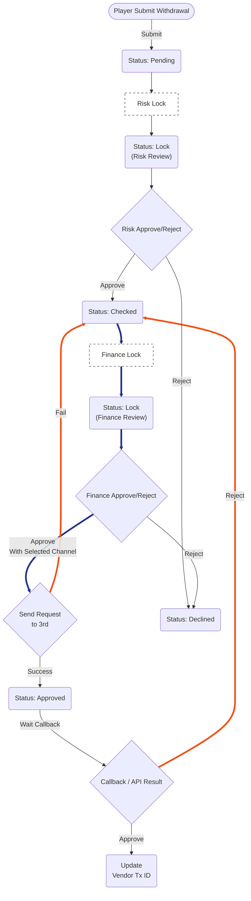

```mermaid
graph TD
    %% 節點定義
    StartAuto(["Player Submit Withdrawal"])
    PendingAuto("Status: Pending")
    
    RiskLockActionBoxAuto["Risk Lock"]
    RiskLockAuto("Status: Lock<br/>(Risk Review)")
    
    RiskActionAuto{"Risk Approve/Reject"}
    ApproveAuto("Status: Checked")
    
    FinanceLockActionBoxAuto["Finance Lock"]
    FinanceLockAuto("Status: Lock<br/>(Finance Review)")
    
    FinanceActionAuto{"Finance Approve/Reject<br/>(Auto)"}
    RequestActionAuto{"Send Request<br/>to 3rd"}
    FinanceApprovedAuto("Status: Approved")

    DeclineAuto("Status: Declined")
    SuccessAuto("Update<br>Vendor Tx ID")
    CallbackAuto{"Callback / API Result"}

    StartAuto -->|"Submit"| PendingAuto
    
    PendingAuto --> RiskLockActionBoxAuto
    RiskLockActionBoxAuto --> RiskLockAuto
    
    RiskLockAuto --> RiskActionAuto
    
    RiskActionAuto -->|"Manual Approve"| ApproveAuto
    
    ApproveAuto ==>|"Auto"| FinanceLockActionBoxAuto
    FinanceLockActionBoxAuto ==>|"Auto"| FinanceLockAuto
    FinanceLockAuto ==>|"Auto"| FinanceActionAuto
    FinanceActionAuto ==>|"Auto Approve<br/>With Auto Selected Channel"| RequestActionAuto
    
    RequestActionAuto -->|"Success"| FinanceApprovedAuto
    RequestActionAuto ==>|"Fail"| DeclineAuto
    
    FinanceApprovedAuto -->|"Wait Callback"| CallbackAuto

    CallbackAuto -->|"Approve"| SuccessAuto
    
    CallbackAuto ==>|"Reject"| DeclineAuto

    RiskActionAuto -->|"Manual Reject"| DeclineAuto

    %% linkStyle 索引 (基於連接線出現順序):
    %% 0: StartAuto -> PendingAuto
    %% 1: PendingAuto -> RiskLockActionBoxAuto
    %% 2: RiskLockActionBoxAuto -> RiskLockAuto
    %% 3: RiskLockAuto -> RiskActionAuto
    %% 4: RiskActionAuto -> ApproveAuto
    %% 5: ApproveAuto ==> FinanceLockActionBoxAuto
    %% 6: FinanceLockActionBoxAuto ==> FinanceLockAuto
    %% 7: FinanceLockAuto ==> FinanceActionAuto
    %% 8: FinanceActionAuto ==> RequestActionAuto
    %% 9: RequestActionAuto --> FinanceApprovedAuto
    %% 10: RequestActionAuto ==> DeclineAuto (Fail)
    %% 11: FinanceApprovedAuto --> CallbackAuto
    %% 12: CallbackAuto --> SuccessAuto
    %% 13: CallbackAuto ==> DeclineAuto (Reject)
    %% 14: RiskActionAuto --> DeclineAuto

    linkStyle 5,6,7,8 stroke:#20308c,stroke-width:4px;
    linkStyle 10,13 stroke:#F24F13,stroke-width:4px;

    style RiskLockActionBoxAuto fill:#fff,stroke:#333,stroke-dasharray: 5 5
    style FinanceLockActionBoxAuto fill:#fff,stroke:#333,stroke-dasharray: 5 5
```

# 提款審核流程規格：手動與自動模式對照

---

## 畫面目標

- 規範提款單在不同審核模式下的狀態流轉邏輯。
- 當開啟「自動財務審核」時，簡化審核步驟，並明確 API 失敗或三方拒絕後的處理路徑。
- 支援 Metronic 等不具備帳戶所有權的第三方金流服務整合。

---

## 邏輯定義

- **提款單狀態說明:**
    - `Pending`: 玩家發起提款後的初始狀態。
    - `Lock`: 提款單進入審核鎖定狀態。
    - `Checked`: Risk 團隊審核同意後的狀態。
    - `Approved`: Finance 團隊審核同意，準備或正在向三方發起提款申請的過渡狀態。
    - `Declined`: 任何階段拒絕或三方系統異常後的最終拒絕狀態。

---

## 手動財務審核流程 (Auto OFF)

- **行為描述:** 需 Risk 與 Finance 兩關人工審核。若三方拒絕，流程退回至 `Checked` 供再次處理。
- **流程圖:**



---

## 自動財務審核流程 (Auto ON)

- **行為描述:** Risk 同意後系統背景自動處理。若三方失敗，則**直接拒絕**不退回人工。
- **流程圖:**



---

## 核心行為細節對照

- **手動審核 (OFF):**
    - Finance 點擊同意時，必須跳出彈窗選擇 `Payment Channel`。
    - **IF** 三方 Reject: 流程連回 `Checked`，由財務重新鎖定並選擇其他通道 (**備註**: 此處邏輯依用戶需求調整為退回由 Risk 審核過的 Checked 狀態)。
- **自動審核 (ON):**
    - Risk 同意後，系統背景自動執行 Finance 鎖定與同意，完全跳過人工 Finance UI。
    - **IF** 三方 Reject/API Fail: 狀態**直接轉為 `Declined`**，視為該筆訂單終止，不再退回人工處理。

---

## 混合模式對照流程 (Hybrid Flow)

- **目的:** 呈現系統如何依據「自動財務審核」設定值分流，以及不同模式下失敗路徑的差異。
- **關鍵差異:**
    - **手動模式 (Manual):** API 失敗或三方拒絕後，退回 `Checked`，由財務人工介入重試或改得通道。
    - **自動模式 (Auto):** API 失敗或三方拒絕後，直接 `Decline`，不退回人工，避免無效卡單。

```mermaid
graph TD
    %% === 共用階段 (Risk) ===
    Start(["Player Submit Withdrawal"])
    Pending("Status: Pending")
    
    RiskLockActionBox["Risk Lock"]
    RiskLock("Status: Lock<br/>(Risk Review)")
    
    RiskAction{"Risk Approve/Reject"}
    Checked("Status: Checked")
    
    Switch{"Auto Finance<br/>Enabled?"}

    %% === 手動流程 (Manual Path) ===
    FinanceLockM["Finance Lock<br/>(Manual)"]
    FinanceActionM{"Finance Action<br/>(Select Channel)"}
    RequestM{"Send Request<br/>(Manual)"}
    ApprovedM("Status: Approved<br/>(Wait Callback)")

    %% === 自動流程 (Auto Path) ===
    FinanceLockA["Finance Lock<br/>(Auto)"]
    FinanceActionA{"Finance Action<br/>(Auto)"}
    RequestA{"Send Request<br/>(Auto)"}
    ApprovedA("Status: Approved<br/>(Wait Callback)")

    %% === 終結狀態 ===
    Decline("Status: Declined")
    Success("Update Vendor Tx ID<br/>(Success)")
    
    %% === 共用連接 ===
    Start --> Pending
    Pending --> RiskLockActionBox
    RiskLockActionBox --> RiskLock
    RiskLock --> RiskAction
    
    RiskAction -->|"Reject"| Decline
    RiskAction -->|"Approve"| Checked
    
    Checked ==> Switch

    %% === 分流邏輯 ===
    Switch ==>|"No (Manual)"| FinanceLockM
    Switch ==>|"Yes (Auto)"| FinanceLockA

    %% === Manual 詳細流程 ===
    FinanceLockM ==> FinanceActionM
    FinanceActionM ==>|"Approve"| RequestM
    FinanceActionM -->|"Reject"| Decline
    
    RequestM -->|"Success"| ApprovedM
    RequestM -->|"Fail"| Checked
    
    ApprovedM -->|"Callback: Approve"| Success
    ApprovedM -->|"Callback: Reject"| Checked

    %% === Auto 詳細流程 ===
    FinanceLockA ==> FinanceActionA
    FinanceActionA ==>|"Auto Approve"| RequestA
    
    RequestA -->|"Success"| ApprovedA
    RequestA -->|"Fail"| Decline
    
    ApprovedA -->|"Callback: Approve"| Success
    ApprovedA -->|"Callback: Reject"| Decline

    %% === 樣式定義 ===
    %% 標記 Auto 失敗路徑 (紅色)
    linkStyle 22,24 stroke:#F24F13,stroke-width:4px; 
    %% RequestA->Decline, ApprovedA(Reject)->Decline

    %% 標記 Manual 失敗路徑 (橘色/退回)
    linkStyle 16,18 stroke:#F29F13,stroke-width:4px;
    %% RequestM->Checked, ApprovedM(Reject)->Checked

    %% 標記 主要成功路徑 (藍色加粗)
    linkStyle 7,12,13 stroke:#20308c,stroke-width:4px;
    %% Checked->Switch, Switch->FinLockM, Switch->FinLockA (這段只是分流，可選)
    
    style Switch fill:#ffd700,stroke:#333,stroke-width:2px
    style Checked fill:#e1f5fe,stroke:#01579b
    style Decline fill:#ffebee,stroke:#c62828
    style Success fill:#e8f5e9,stroke:#2e7d32
```