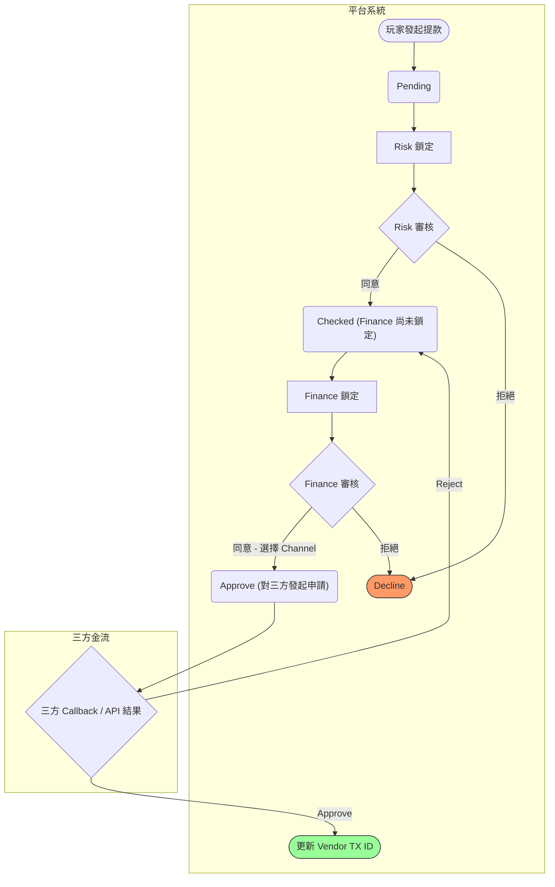

# 提款審核流程規格：手動與自動模式對照

---

## 畫面目標

- 規範提款單在不同審核模式下的狀態流轉邏輯。
- 當開啟「自動財務審核」時，簡化審核步驟，並明確 API 失敗或三方拒絕後的處理路徑。
- 支援 Metronic 等不具備帳戶所有權的第三方金流服務整合。

---

## 邏輯定義

- **提款單狀態說明:**
    - `Pending`: 玩家發起提款後的初始狀態。
    - `Lock`: 提款單進入審核鎖定狀態。
    - `Checked`: Risk 團隊審核同意後的狀態。
    - `Approve`: Finance 團隊審核同意，並已向三方發起提款申請或執行手動出款後的最終核准狀態。
    - `Decline`: 任何階段拒絕或三方系統異常後的最終拒絕狀態。

---

## 手動財務審核流程 (Auto OFF)

- **行為描述:** 需 Risk 與 Finance 兩關人工審核。若三方拒絕，流程退回至 `Checked` 供再次處理。
- **流程圖:**



---

## 自動財務審核流程 (Auto ON)

- **行為描述:** Risk 同意後系統背景自動處理。若三方失敗，則**直接拒絕**不退回人工。
- **流程圖:**

```mermaid
graph TD
    %% 節點定義
    Start_A(["玩家發起提款"])
    Pending_A("Pending")
    Risk_Lock_A["Risk 鎖定"]
    Risk_Action_A{"Risk 審核"}
    Approve_Auto("Approve (系統自動選擇 Channel)")
    Approve_Req_A("Approve (對三方發起申請)")
    Decline_A(["Decline"])
    Success_A(["更新 Vendor TX ID"])
    Callback_A{"三方 Callback / API 結果"}

    subgraph Platform_Auto [平台系統 - 自動模式]
        Start_A --> Pending_A
        Pending_A --> Risk_Lock_A
        Risk_Lock_A --> Risk_Action_A
        
        %% 高亮自動化路徑
        Risk_Action_A -- "同意 (自動觸發)" ===> Approve_Auto
        Approve_Auto ===> Approve_Req_A

        Risk_Action_A -- "拒絕" --> Decline_A
        Success_A
    end

    subgraph Third_Party_A [三方金流]
        Approve_Req_A --> Callback_A
    end

    Callback_A -- "Approve" --> Success_A
    
    %% 高亮報廢路徑
    Callback_A -- "Reject / API Fail" --x Decline_A

    %% 樣式與連結美化
    %% linkStyle 索引 (基於連接線出現順序):
    %% 0: Start_A -> Pending_A
    %% 1: Pending_A -> Risk_Lock_A
    %% 2: Risk_Lock_A -> Risk_Action_A
    %% 3: Risk_Action_A == "同意" ==> Approve_Auto
    %% 4: Approve_Auto ===> Approve_Req_A
    %% 5: Risk_Action_A -- "拒絕" --> Decline_A
    %% 6: Approve_Req_A --> Callback_A
    %% 7: Callback_A -- "Approve" --> Success_A
    %% 8: Callback_A -- "Reject" --x Decline_A

    linkStyle 3 stroke:#2196f3,stroke-width:4px;
    linkStyle 4 stroke:#2196f3,stroke-width:4px;
    linkStyle 8 stroke:#f44336,stroke-width:2px;

    style Decline_A fill:#f96,stroke:#333
    style Success_A fill:#9f9,stroke:#333
    style Approve_Auto fill:#e3f2fd,stroke:#2196f3
```

---

## 核心行為細節對照

- **手動審核 (OFF):**
    - Finance 點擊同意時，必須跳出彈窗選擇 `Payment Channel`。
    - **IF** 三方 Reject: 流程連回 `Checked`，由財務重新鎖定並選擇其他通道。
- **自動審核 (ON):**
    - Risk 同意後，系統背景自動執行 Finance 鎖定與同意，完全跳過人工 Finance UI。
    - **IF** 三方 Reject/API Fail: 狀態**直接轉為 `Decline`**，視為該筆訂單終止，不再退回人工處理。

---

**文件結束**
