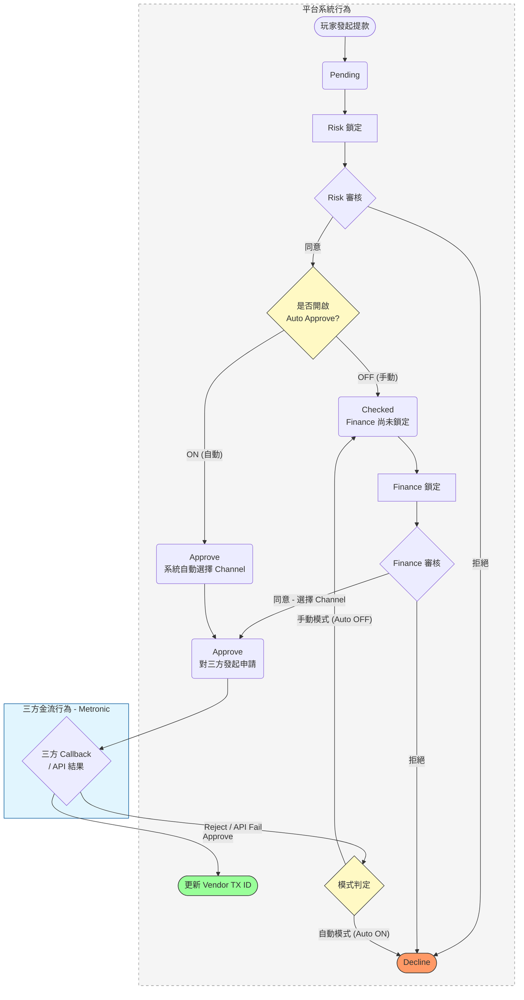

# 提款審核流程規格：全域流程圖 (手動/自動對照)

---

## 畫面目標

- 規範提款單在不同審核模式下的狀態流轉邏輯。
- 當開啟「自動財務審核」時，簡化審核步驟，並明確 API 失敗或三方拒絕後的處理路徑。
- 支援 Metronic 等不具備帳戶所有權的第三方金流服務整合。

---

## 邏輯定義

- **提款單狀態說明:**
    - `Pending`: 玩家發起提款後的初始狀態。
    - `Lock`: 提款單進入審核鎖定狀態。
    - `Checked`: Risk 團隊審核同意後的狀態。
    - `Approve`: Finance 團隊審核同意，並已向三方發起提款申請或執行手動出款後的最終核准狀態。
    - `Decline`: 任何階段拒絕或三方系統異常後的最終拒絕狀態。

---

## 全域流程圖

---

## 核心行為細節

- **手動審核流程細節:**
    - Finance 點擊同意時，必須跳出彈窗選擇 `Payment Channel`。
    - 若三方 Callback 回傳 `Reject`，則狀態退回至 `Checked` 供財務人員手動再次鎖定/重選通道。
- **自動審核流程細節:**
    - 系統應提供「預設自動提款通道」設定。
    - Risk 同意後，系統背景自動執行 Finance 鎖定並同意，不需人工操作。
    - **IF** 三方 API 建立提款單失敗 **OR** 回傳 `Reject`:
        - 狀態直接轉為 `Decline`。
        - **行為:** 為了與 T1 包網平台的簡便流程對齊，自動模式下若發生錯誤不退回人工處理。

---

**文件結束**
